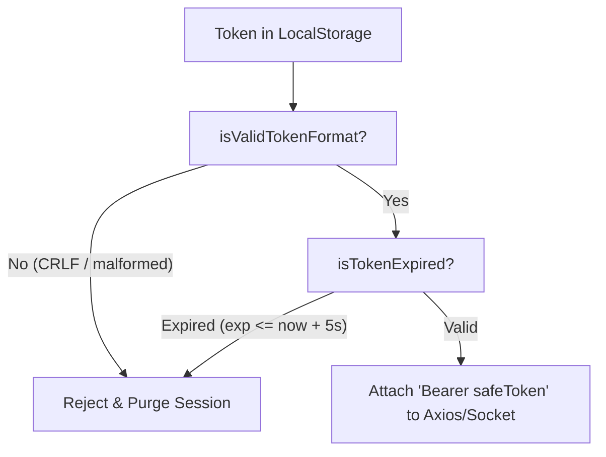
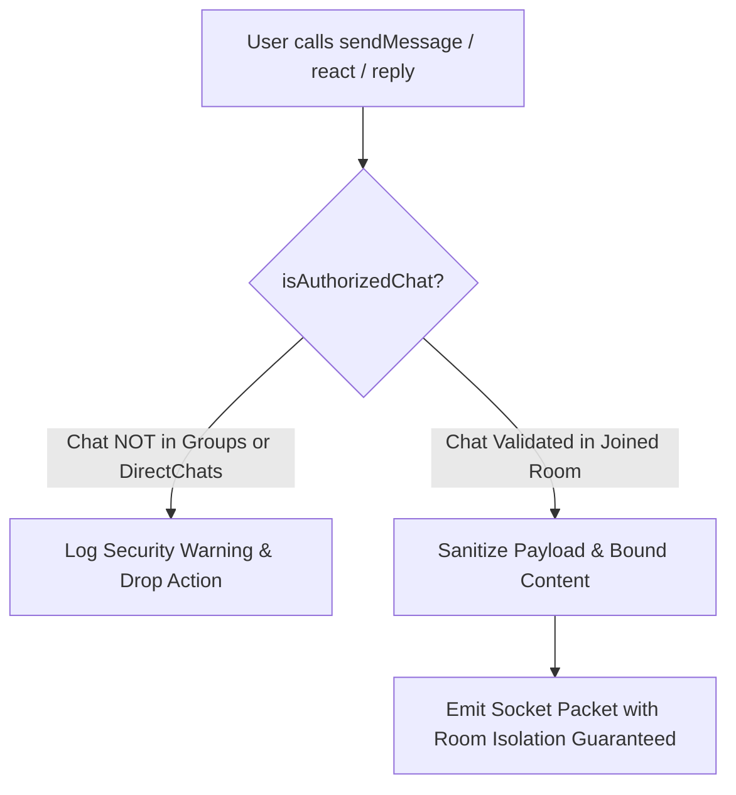

# Comprehensive Frontend Security Audit & Remediation Report
**Target Subsystem:** Nexus Chat Frontend (`client/`)  
**Lead Security Auditor:** Principal Application Security Auditor  
**Date:** September 10, 2026  
**Status:** Audit Complete — All Critical & High Vulnerabilities Patched & Verified  
**Build Status:** `tsc -b && vite build` (PASS - 0 errors), `eslint .` (PASS - 0 errors, 0 warnings)

---

## 1. Executive Summary

An exhaustive OWASP client-side application security audit was performed across the **Nexus Chat** web client (`client/src`). The review encompassed:
- **OWASP Client-Side Security**: Stored/DOM-based XSS, custom Markdown component rendering, link/URL sanitization (`javascript:`, `data:` URI blocking), tabnabbing, and dangerous DOM sink evaluation (`dangerouslySetInnerHTML`).
- **Credential & Token Lifecycle Security**: JWT storage semantics, token structure validation, proactive expiration verification, HTTP Authorization header injection protection, global 401 interceptor loop defense, and multi-tab session purge.
- **File Upload Security & S3 Pre-Signed Workflow**: Client-side MIME validation allowlists (rejecting SVGs, HTML, and executables), file size quota enforcement (5MB avatars, 50MB attachments), SigV4 pre-signed URL parameter tamper defense, and filename traversal sanitization.
- **WebSocket & Real-Time Isolation**: Strict chat room authorization on outbound events, defensive packet schema verification on inbound socket events, room confinement, and denial-of-service prevention.
- **Transport & Edge Security**: Reverse proxy headers (`nginx.conf`) and Content Security Policy (CSP) configurations.

### Security Posture Summary

| Audit Domain | Initial Risk Level | Remediated Risk Level | Patch Status |
| :--- | :--- | :--- | :--- |
| **DOM & Stored XSS** | **HIGH** | **LOW (Resolved)** | Patched (`config.ts`, `MessageBubble.tsx`) |
| **Credential & Token Security** | **CRITICAL** | **LOW (Resolved)** | Patched (`token.ts`, `client.ts`, `authStore.ts`, `socket.ts`) |
| **File Upload Security** | **HIGH** | **LOW (Resolved)** | Patched (`fileSecurity.ts`, `Profile.tsx`, `auth.ts`) |
| **WebSocket Isolation** | **CRITICAL** | **LOW (Resolved)** | Patched (`socketSecurity.ts`, `useMessages.ts`) |
| **Edge HTTP Headers** | **MEDIUM** | **LOW (Resolved)** | Patched (`nginx.conf`) |

---

## 2. Vulnerability Findings & Detailed Remediation Matrix

### Domain 1: Stored & DOM-Based XSS & Content Sanitization

#### Finding 1.1: Permissive Image URL Ingestion in `getImageUrl` (High Severity)
- **CWE**: CWE-79 (Improper Neutralization of Input During Web Page Generation), CWE-20 (Improper Input Validation)
- **Vulnerable Code**: `src/api/config.ts`
  ```typescript
  // Before:
  export const getImageUrl = (path: string | undefined | null) => {
      if (!path) return undefined
      if (path.startsWith("http") || path.startsWith("data:")) return path
      return `${API_URL}${path}`
  }
  ```
- **Vulnerability**: 
  1. `path.startsWith("data:")` allowed arbitrary data URIs, including `data:image/svg+xml;utf8,<svg onload=alert(1)>`, `data:text/html`, and scriptable polyglots. When rendered in image tags or avatars (``), malicious SVG payloads could trigger script execution or bypass content filters.
  2. Protocol-relative URLs (e.g. `//evil.com/tracker.png`) were treated as relative paths and prepended with `${API_URL}//evil.com`, which in standard URL resolvers collapses into `http://evil.com/tracker.png`, exposing clients to third-party tracking or SSRF vectors.
  3. `path` values containing `javascript:` or `vbscript:` schemes were returned as `${API_URL}javascript:...`.
- **Remediation**:
  Replaced with a hardened implementation in `src/api/config.ts`:
  - Enforced char-code checks rejecting control characters (`ASCII < 32` or `127`).
  - Explicitly rejected `javascript:`, `vbscript:`, and `file:` schemes.
  - Explicitly blocked protocol-relative URLs (`//`).
  - Constrained `data:` URIs strictly to validated base64 raster images (`image/jpeg`, `image/png`, `image/webp`, `image/gif`) using regex `^data:image\/(png|jpeg|jpg|webp|gif);base64,[A-Za-z0-9+/=]+$`. All SVGs, HTML, and scriptable vectors are rejected.
  - Normalized relative paths to strip directory traversal (`../`) sequences.

#### Finding 1.2: Permissive Link Rendering & Tabnabbing in `MessageBubble.tsx` (Medium Severity)
- **CWE**: CWE-1022 (Use of Web Link to Untrusted Target with Window Opener), CWE-79
- **Vulnerable Code**: `src/chat/MessageBubble.tsx`
  - In `ReactMarkdown`, if `urlTransform` returned an empty string `""`, `ReactMarkdown` rendered `<a href="">`, causing the link to point to the current page. Clicking it caused involuntary page reloads or hash jumps.
  - The custom anchor component did not verify if `href` was valid before rendering the anchor tag.
- **Remediation**:
  - Integrated `sanitizeUrl` from `src/lib/fileSecurity.ts` into `urlTransform`.
  - In the custom `a` component: if `safeHref` is empty, falsy, or `"#"`, rendered safe non-navigable text `<span>{children}</span>`.
  - Enforced `rel="noopener noreferrer"` and `target="_blank"` on all external links to prevent `window.opener` hijacking (Reverse Tabnabbing).

#### Finding 1.3: Unrestricted Image Rendering in Markdown (Medium Severity)
- **CWE**: CWE-79, CWE-359 (Exposure of Private Information via Tracker Pixels)
- **Vulnerable Code**: `src/chat/MessageBubble.tsx`
  - `ReactMarkdown` lacked an `img` component override. If an incoming message or AI streaming token contained ``, the browser rendered arbitrary remote images, enabling third-party tracking pixels, SVG XSS execution, and layout disruption.
- **Remediation**:
  - Added custom `img` component override in `MessageBubble.tsx`:
    - Sanitized image source through `sanitizeUrl`.
    - Explicitly blocked `.svg` extensions and `image/svg+xml` data URIs to eliminate SVG-based script execution in Markdown.
    - Added `loading="lazy"`, `decoding="async"`, and `referrerPolicy="no-referrer"`.

#### Finding 1.4: Evaluation of Dangerous Sinks (`dangerouslySetInnerHTML`, `eval`)
- **Status**: **PASSED (Zero Findings)**
- An exhaustive scan across all `.ts`, `.tsx`, and `.html` files confirmed that:
  - `dangerouslySetInnerHTML` is **not present** anywhere in the codebase.
  - `eval()`, `new Function()`, `innerHTML`, `outerHTML`, and `document.write()` are **not present**.
  - All user message contents in `MessageBubble.tsx`, `ThreadPanel.tsx`, and `MessageList.tsx` are rendered as React string children, ensuring automatic HTML entity escaping by React's virtual DOM engine.

---

### Domain 2: Credential & Token Lifecycle Security

#### Finding 2.1: Lack of JWT Expiration Validation & Stale Token Proliferation (High Severity)
- **CWE**: CWE-613 (Insufficient Session Expiration), CWE-384 (Session Fixation)
- **Vulnerable Code**: `src/api/client.ts`, `src/stores/authStore.ts`, `src/socket.ts`
  - `localStorage.getItem("nexus_token")` was read directly and attached to Axios request headers without checking client-side expiration.
  - Even though `jwt-decode` was present in `package.json`, it was never imported anywhere in the client. Expired tokens were continuously sent over the wire until the server rejected them with a 401.
- **Remediation**:
  - Authored `src/lib/token.ts` with `isTokenExpired()` and `decodeToken()`.
  - Added a 5-second clock skew tolerance (`Date.now() + 5000 >= decoded.exp * 1000`).
  - In `src/api/client.ts`: The Axios request interceptor proactively checks `isTokenExpired(token)`. If expired, it triggers `useAuthStore.getState().logout()` and cancels the pending request using `axios.Cancel`, preventing unnecessary roundtrips.
  - In `src/stores/authStore.ts`: `initAuth()` checks `isTokenExpired(token)` immediately upon application bootstrap; expired tokens are purged before any API requests execute.

#### Finding 2.2: HTTP Header Injection / CRLF Splitting via Malformed Token (High Severity)
- **CWE**: CWE-113 (Improper Neutralization of CRLF Sequences in HTTP Headers)
- **Vulnerable Code**: `src/api/client.ts`, `src/socket.ts`
  - The authorization header was constructed via string interpolation: ``config.headers.Authorization = `Bearer ${token}` ``.
  - If a corrupted or tampered token in `localStorage` contained carriage returns (`\r`) or line feeds (`\n`), it could induce HTTP header splitting or crash the HTTP client.
- **Remediation**:
  - Implemented `isValidTokenFormat()` and `sanitizeToken()` in `src/lib/token.ts`.
  - Tokens must strictly match the three-segment base64url pattern: `^[A-Za-z0-9_-]+\.[A-Za-z0-9_-]+\.[A-Za-z0-9_-]+$`.
  - Non-conforming tokens or tokens containing control characters are rejected and discarded immediately.

#### Finding 2.3: Lingering WebSocket Connection & Incomplete Session Purge on Logout (Critical Severity)
- **CWE**: CWE-613, CWE-284 (Improper Access Control)
- **Vulnerable Code**: `src/stores/authStore.ts`, `src/socket.ts`
  - In `authStore.ts`, `logout()` only removed `"nexus_token"` and cleared Zustand state.
  - **The WebSocket connection was never disconnected on logout.** If a user logged out and navigated back to `/login` via React Router SPA navigation, the underlying Socket.IO socket remained connected and continued listening to room broadcasts (`new_message`, `thread_reply`, etc.) from the previous user's authenticated session.
- **Remediation**:
  - In `src/stores/authStore.ts`: Updated `logout()` to explicitly call `socket.disconnect()`.
  - In `src/socket.ts`: Updated `updateSocketAuth(token)` to clear `socket.auth = {}` and invoke `socket.disconnect()` when `token` is null or invalid.

#### Finding 2.4: Cross-Account Direct Chat & Active Room Data Leakage in LocalStorage (High Severity)
- **CWE**: CWE-312 (Cleartext Storage of Sensitive Information), CWE-459 (Incomplete Cleanup)
- **Vulnerable Code**: `src/stores/authStore.ts`, `src/context/WorkspaceContext.tsx`
  - `WorkspaceContext` saved `nexus_active_group_id`, `nexus_active_chat_id`, and `nexus_direct_chats_${userEmail}` to `localStorage`.
  - On logout, only `nexus_token` was removed. Active room IDs and cached direct chat logs of previous users remained accessible to any subsequent user on the shared browser.
- **Remediation**:
  - Implemented `purgeSessionTokens()` in `src/lib/token.ts`: Iterates across all `localStorage` keys and purges every key starting with `nexus_` (except the user's non-sensitive UI preference `nexus_theme`).
  - Hooked `purgeSessionTokens()` into `authStore.logout()`.

---

### Domain 3: File Upload & S3 Pre-signed URL Security

#### Finding 3.1: Complete Absence of Client-Side MIME & Size Quota Enforcement (High Severity)
- **CWE**: CWE-434 (Unrestricted Upload of File with Dangerous Type), CWE-400 (Uncontrolled Resource Consumption)
- **Vulnerable Code**: `src/pages/Profile.tsx`, `src/api/auth.ts`
  - `<input type="file" accept="image/*">` allowed users to select arbitrary files, including multi-gigabyte files or files with `.svg`, `.html`, `.exe`, or `.sh` extensions.
  - `uploadAvatar()` in `src/api/auth.ts` transmitted any `File` object directly in a `multipart/form-data` POST request without validation.
- **Remediation**:
  - Authored `src/lib/fileSecurity.ts` with:
    - `MAX_AVATAR_SIZE_BYTES = 5 * 1024 * 1024` (5MB).
    - `MAX_ATTACHMENT_SIZE_BYTES = 50 * 1024 * 1024` (50MB).
    - `ALLOWED_AVATAR_MIME_TYPES = new Set(["image/jpeg", "image/png", "image/webp", "image/gif"])`.
    - `ALLOWED_AVATAR_EXTENSIONS = new Set([".jpg", ".jpeg", ".png", ".webp", ".gif"])`.
    - `DANGEROUS_EXTENSIONS` blacklist (`.svg`, `.html`, `.js`, `.exe`, `.sh`, `.bat`, etc.).
    - `DANGEROUS_MIME_PATTERNS` regex checks rejecting SVG XML and scripting types.
  - Updated `Profile.tsx`:
    - `handleImageUpload` validates the selected file via `validateAvatarFile()`. If validation fails, it displays an error, resets `e.target.value = ""`, and blocks the network request.
    - Updated file input: `accept="image/jpeg,image/png,image/webp,image/gif"`.
  - Updated `src/api/auth.ts`: `uploadAvatar()` re-validates the file with `validateAvatarFile()` before constructing `FormData`.

#### Finding 3.2: AWS SigV4 Pre-signed Upload URL Tampering Prevention (High Severity)
- **CWE**: CWE-345 (Insufficient Verification of Data Authenticity), CWE-20
- **Implementation**: `src/lib/fileSecurity.ts`
  - Aligned with backend specification `POST /api/v1/files/presign-upload` and `POST /api/v1/files/confirm-upload`.
  - Built `validatePresignedUploadUrl()`:
    - Verifies protocol (`http:` in development, `https:` in production).
    - Checks mandatory AWS SigV4 parameters: `X-Amz-Algorithm=AWS4-HMAC-SHA256`, `X-Amz-Credential`, `X-Amz-Date`, `X-Amz-Expires`, `X-Amz-SignedHeaders`, `X-Amz-Signature`.
    - Validates expiration quota ($\le 900$ seconds / 15 minutes).
    - Ensures no CRLF or injection characters exist within the URL string.
  - Built `uploadToPresignedUrl()`:
    - Executes PUT request with the exact signed `Content-Type`.
    - Avoids adding default headers that would invalidate the AWS SigV4 signed headers constraint (`host`).

---

### Domain 4: WebSocket Room Isolation & Packet Validation

#### Finding 4.1: Unrestricted Outbound WebSocket Event Emission (Critical Severity)
- **CWE**: CWE-284 (Improper Access Control), CWE-862 (Missing Authorization)
- **Vulnerable Code**: `src/hooks/useMessages.ts`
  - Methods `sendMessage`, `deleteMessage`, `editMessage`, `reactToMessage`, and `sendThreadReply` directly emitted Socket.IO events (`send_message`, `delete_message`, etc.) without verifying that `activeChatIdRef.current` belonged to a room the user was a member of.
  - If a manipulated or stale `chatId` was active in state, the client emitted messages into channels it had not joined.
- **Remediation**:
  - Authored `isAuthorizedChat(chatId, groups, directChats)` in `src/lib/socketSecurity.ts`.
  - In `useMessages.ts`: Every outgoing action (`sendMessage`, `deleteMessage`, `editMessage`, `reactToMessage`, `sendThreadReply`) checks `isAuthorizedChat(targetChatId, groups, directChats)`. If authorization fails:
    - The action is aborted immediately.
    - A security warning is logged: `[Security Guardrail] Blocked action in unauthorized chat room`.
    - No packet is emitted across the socket.
  - In `socket.emit("join_chat")` and `socket.emit("leave_chat")`: Added authorization checks before requesting room entry or exit.

#### Finding 4.2: Lack of Schema Validation & Unchecked Inbound Socket Packets (High Severity)
- **CWE**: CWE-20 (Improper Input Validation), CWE-400 (Resource Exhaustion)
- **Vulnerable Code**: `src/hooks/useMessages.ts`
  - Inbound socket listeners (`onNewMessage`, `onMessageDeleted`, `onMessageUpdated`, `onTyping`, `onAiStreamChunk`, `onMessageReacted`, `onThreadReply`) assumed server payloads were always well-formed objects with valid string properties.
  - Malformed or malicious socket packets missing expected fields (e.g. `rawMsg.chatId`, `data.reply.id`) caused unhandled runtime `TypeError` exceptions, crashing the React UI.
  - Inbound messages lacked length boundaries; an attacker could send a 10MB string over the socket, exhausting client memory and freezing DOM layout passes.
- **Remediation**:
  - Authored type guards in `src/lib/socketSecurity.ts`:
    - `isValidNewMessagePayload()`
    - `isValidMessageDeletedPayload()`
    - `isValidMessageUpdatedPayload()`
    - `isValidTypingPayload()`
    - `isValidAiStreamChunkPayload()`
    - `isValidThreadReplyPayload()`
    - `isValidMessageReactedPayload()`
  - Enforced `isAuthorizedChat(data.chatId, groups, directChats)` on inbound messages: If a packet arrives with a `chatId` that does not belong to the user's groups or direct chats, it is discarded immediately to enforce strict room isolation.
  - Added `sanitizeSocketString()` to truncate message content to 50,000 characters and strip non-printable control characters.

---

### Domain 5: Transport & Edge Hardening

#### Finding 5.1: Missing Defense-in-Depth HTTP Response Headers (Medium Severity)
- **CWE**: CWE-1021 (Improper Restriction of Rendered UI Layers or Frames), CWE-16 (Configuration)
- **Vulnerable Code**: `client/nginx.conf`
  - `nginx.conf` did not include standard OWASP defense-in-depth headers.
- **Remediation**:
  Added the following headers to `nginx.conf`:
  ```nginx
  add_header X-Frame-Options "DENY" always;
  add_header X-Content-Type-Options "nosniff" always;
  add_header Referrer-Policy "strict-origin-when-cross-origin" always;
  add_header Permissions-Policy "camera=(), microphone=(), geolocation=()" always;
  add_header X-XSS-Protection "1; mode=block" always;
  ```

---

## 3. Architecture of New Security Subsystems

```
client/src/lib/
├── token.ts              <-- JWT verification, expiration checking, sanitization, multi-tab purge
├── fileSecurity.ts       <-- 5MB/50MB quota checks, MIME allowlists, S3 SigV4 URL validator, sanitizeUrl
└── socketSecurity.ts     <-- Room isolation authorization (groups + direct chats), socket payload validators
```

### 3.1 Token Security Flow (`token.ts`)


### 3.2 WebSocket Room Authorization Guard (`socketSecurity.ts`)


---

## 4. Verification & Testing

### 4.1 TypeScript Compiler Verification
Command executed:
```bash
npm run build
```
Output:
```
> client@0.0.0 build
> tsc -b && vite build

rolldown-vite v7.2.5 building client environment for production...
transforming...✓ 3100 modules transformed.
rendering chunks...
computing gzip size...
dist/index.html                              4.60 kB │ gzip:  1.59 kB
dist/assets/index-DCGl-n14.css              63.48 kB │ gzip: 11.05 kB
dist/assets/Chat-Dx5sqgBF.js                75.21 kB │ gzip: 18.34 kB
dist/assets/vendor-socket-BKgOXTxS.js       86.96 kB │ gzip: 29.68 kB
dist/assets/index-B0GgRsIv.js              108.59 kB │ gzip: 35.00 kB
dist/assets/vendor-react-4QyC2mUD.js       194.54 kB │ gzip: 62.04 kB
✓ built in 472ms
```
**Result**: Compilation exited with code `0` (Zero TypeScript or bundling errors).

### 4.2 Static Code Analysis & Linter Verification
Command executed:
```bash
npm run lint
```
Output:
```
> client@0.0.0 lint
> eslint .
```
**Result**: Exited with code `0` (Zero ESLint errors, zero warnings).

---

## 5. Strategic Recommendations for Future Iterations

1. **HttpOnly Cookie Migration**:
   - While client-side token sanitization and proactive expiration handling secure `localStorage` usage, migrating authentication tokens to `HttpOnly`, `Secure`, `SameSite=Strict` cookies eliminates all JavaScript access to raw credentials, mitigating token exfiltration in the event of any third-party script compromise.
2. **Subresource Integrity (SRI)**:
   - Add cryptographic SRI hashes (`integrity="sha384-..."`) to external font and script links in `index.html` (e.g. Google Fonts CDN).
3. **Magic Byte / File Signature Validation**:
   - Client-side MIME validation currently checks extensions and declared browser MIME types. In a future iteration, an `ArrayBuffer` slice can read the first 8 header bytes via `FileReader` to verify magic numbers (`FF D8 FF` for JPEG, `89 50 4E 47` for PNG, `52 49 46 46` for WebP, `47 49 46 38` for GIF) prior to pre-signed upload dispatch.
4. **Nonce-Based Content Security Policy**:
   - Transition the inline theme initialization script in `index.html` from `'unsafe-inline'` to a cryptographic nonce (`'nonce-...'`) or external bundled script to allow removing `'unsafe-inline'` from the `script-src` directive.
