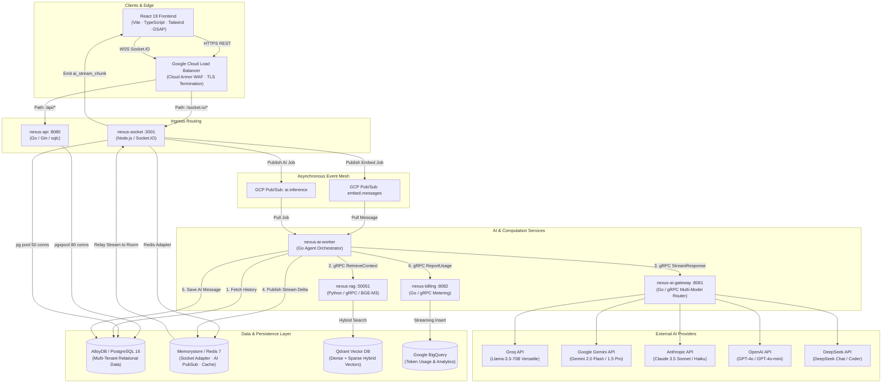

# Nexus Workplace AI — Current State & Technical Inventory

> **Document Version**: 2.0  
> **Architecture Status**: Polyglot Distributed Microservices (Production-Hardened)  
> **Codebase Repository**: `Rajat25022005/Nexus-chat`

---

## 1. Executive Summary & System Overview

**Nexus Workplace AI** is an enterprise-grade agentic collaboration platform that unifies low-latency real-time communication with context-aware artificial intelligence. Rather than acting as a disconnected chatbot, Nexus operates as an active workspace collaborator that maintains conversational history, organizational memory, and domain knowledge across workspaces, groups, and channels.

### Architectural Evolution
The codebase has evolved from an initial monolithic prototype (Python / FastAPI / MongoDB) into a **distributed, multi-tenant microservices architecture** engineered for high concurrency, horizontal scalability, and low latency:
- **Core REST API**: High-throughput Go (Gin + `pgx/v5` + `sqlc`) service managing authentication, multi-tenant RBAC, workspaces, groups, channels, and audit logs.
- **Real-Time Gateway**: Event-driven Node.js (Socket.IO + `@socket.io/redis-adapter` + `pg`) service handling WebSocket connections, session authorization, atomic message mutations, reactions, thread replies, and presence.
- **Dedicated RAG Engine**: Python (FastAPI + gRPC + PyTorch + Qdrant) service performing dense (BGE-M3 1024-dim) + lexical sparse hybrid embeddings, vector similarity search with Reciprocal Rank Fusion (RRF), and cross-encoder reranking (BGE-Reranker).
- **AI Gateway**: Go gRPC service routing queries across multiple LLM providers (Groq Llama-3.3-70B, Google Gemini, Anthropic Claude, OpenAI GPT-4o, DeepSeek) with Sony `gobreaker` circuit breakers, caching, and fallback chains.
- **Asynchronous Worker Pipeline**: Go consumer listening to GCP Cloud Pub/Sub (`ai.inference` & `embed.messages`), synthesizing multi-turn conversation history and semantic context, streaming deltas via Redis Pub/Sub, and updating persistence layers.
- **Metering & Billing**: Go gRPC service streaming token usage data to Google BigQuery for tenant analytics and usage reporting.
- **Frontend Client**: Modern React 19 + TypeScript + Vite + Tailwind CSS + GSAP application featuring real-time messaging, streaming markdown responses, interactive message threads, emoji reactions, invite codes, command palette (⌘K), and dark/light themes.

---

## 2. High-Level System Architecture



---

## 3. Microservice Deep-Dive (Detailed Breakdown)

### 3.1. `nexus-api` — Core REST & Multi-Tenant Management
- **Language/Runtime**: Go 1.22+
- **HTTP Engine**: Gin Web Framework (`github.com/gin-gonic/gin`)
- **Database Driver & ORM**: `jackc/pgx/v5` connection pool with type-safe query generation via `sqlc`.
- **Primary Responsibilities**:
  1. **User Identity & Auth**: Secure bcrypt password hashing (cost factor 10), JWT token issuance (HS256) with configurable TTL, user profile management.
  2. **Atomic Organization Onboarding**: Single transactional registration that creates `User` → `Tenant` → `Workspace` → `WorkspaceMember(owner)` → `Group(General)` → `GroupMember(owner)` → `Chat(general)` atomically.
  3. **Enterprise Group Identifier System**: Generates collision-resistant Crockford Base32 invite codes formatted as `NX7K-Q2R9`.
  4. **Workspace & Group RBAC**: Comprehensive permission checks (owner, admin, member) on group mutations, member additions, and soft deletes.
  5. **Audit Logging**: Immutable event logging (`group_audit_log`) for organizational tracking.
  6. **Chat & Message REST Endpoints**: Message history queries with pagination (`limit`, `offset`), reaction payload unmarshaling, reply object mapping, and thread message hierarchy listing.
- **Connection Pool Tuning**:
  - `MaxConns`: 80
  - `MinConns`: 15
  - `MaxConnLifetime`: 30 minutes
  - `MaxConnIdleTime`: 5 minutes
  - Connection retry loop with exponential backoff on startup.
- **Exposed Endpoints**:
  | Method | Path | Auth Required | Description |
  |---|---|---|---|
  | `GET` | `/health` | No | Liveness probe returning service status |
  | `GET` | `/live` | No | Basic process liveness probe |
  | `GET` | `/ready` | No | Database connection ping readiness check |
  | `POST` | `/api/auth/register` | No | User registration with atomic workspace bootstrapping |
  | `POST` | `/api/auth/login` | No | User authentication returning JWT token |
  | `GET` | `/api/auth/me` | Yes (JWT) | Authenticated user profile |
  | `PUT` | `/api/auth/profile` | Yes (JWT) | Profile metadata updates |
  | `POST` | `/api/auth/profile/avatar` | Yes (JWT) | Profile avatar upload handler |
  | `POST` | `/api/workspaces` | Yes (JWT) | Create workspace |
  | `GET` | `/api/workspaces` | Yes (JWT) | List workspaces for tenant & user |
  | `GET` | `/api/workspaces/:id` | Yes (JWT) | Get single workspace details |
  | `GET` | `/api/workspaces/:id/members` | Yes (JWT) | List workspace members |
  | `POST` | `/api/workspaces/:id/members` | Yes (JWT) | Add member to workspace (owner/admin only) |
  | `POST` | `/api/groups` | Yes (JWT) | Create group channel with invite code generation |
  | `GET` | `/api/groups` | Yes (JWT) | List groups the user belongs to (with auto-provisioning) |
  | `POST` | `/api/groups/join` | Yes (JWT) | Join group using Crockford Base32 invite code |
  | `DELETE` | `/api/groups/:id` | Yes (JWT) | Soft-delete group (owner only) |
  | `POST` | `/api/chats` | Yes (JWT) | Create chat channel inside a group |
  | `GET` | `/api/chats` | Yes (JWT) | List chat channels within a group |
  | `GET` | `/api/chats/:id/messages` | Yes (JWT) | Paginated message history (limit/offset) |
  | `GET` | `/api/messages/:id/thread` | Yes (JWT) | Fetch thread replies for a parent message |

---

### 3.2. `nexus-socket` — Real-Time WebSocket Microservice
- **Language/Runtime**: Node.js (v20 Alpine)
- **Frameworks**: `socket.io` (v4), `pg` (PostgreSQL client pool), `redis` (v4), `@google-cloud/pubsub`
- **Primary Responsibilities**:
  1. **Authorized Room Join (`join_chat`)**: Enforces database authorization prior to room attachment (`socket.join('chat:' + chatId)`). Checks workspace membership, group visibility (public vs member vs owner), and soft-delete state.
  2. **Single-Trip Atomic Message Ingestion**: Executes a PostgreSQL Single CTE that verifies workspace membership and performs the `INSERT INTO messages` in one database round-trip.
  3. **Atomic Emoji Reaction Toggle CTE**: Employs an `INSERT ... ON CONFLICT DO NOTHING` + `DELETE ... WHERE NOT EXISTS` CTE on `message_reactions` to guarantee race-condition-free reaction toggling.
  4. **Transactional Thread Replies**: Atomically inserts into `thread_messages` and increments the parent message's `thread_count` and `thread_last_reply_at` inside a single transaction.
  5. **Horizontal Pod Scaling**: Utilizes `@socket.io/redis-adapter` for multi-pod message synchronization and broadcast.
  6. **AI Stream Relay**: Subscribes to Redis pattern `room:*:ai_stream`. Delivers streaming chunks with strict sequence indexing (`seq`) and error framing to local clients.
  7. **Fault-Tolerant Redis Reconnect**: Implements an infinite exponential backoff strategy with ±20% jitter (`Math.min(500 * 2^retries, 30000)`).
  8. **Advisory Lock Migrations**: Automatically verifies and migrates tables (`message_reactions`, `thread_messages`, `thread_count`) on startup guarded by `pg_advisory_xact_lock`.
  9. **8-Stage Phased Graceful Shutdown**: Handles `SIGTERM`/`SIGINT` by stopping HTTP ingress, closing Socket.IO, draining in-flight queries, closing Redis connections, and terminating cleanly.
- **Socket.IO Event Inventory**:
  | Direction | Event Name | Payload Highlights | Description |
  |---|---|---|---|
  | Client → Server | `join_chat` | `{ chatId, groupId }` | Authorizes user against Postgres and joins room |
  | Client → Server | `leave_chat` | `{ chatId }` | Leaves Socket.IO chat room |
  | Client → Server | `send_message` | `{ chatId, groupId, tenantId, workspaceId, content, triggerAI, tempId }` | Single CTE insert + broadcast + Pub/Sub dispatch |
  | Client → Server | `edit_message` | `{ messageId, chatId, content }` | Updates message content and sets `is_edited = true` |
  | Client → Server | `delete_message` | `{ messageId, chatId }` | Soft-deletes message (`is_deleted = true`) |
  | Client → Server | `react_message` | `{ messageId, emoji, groupId, chatId }` | Atomic CTE toggle on reaction table |
  | Client → Server | `send_thread_reply` | `{ parentMessageId, content, groupId, chatId, tempId }` | Transactional reply insertion and counter update |
  | Server → Client | `new_message` | `{ id, tempId, chatId, content, role, userEmail, ... }` | Broadcast new message to room |
  | Server → Client | `ai_stream_chunk` | `{ chatId, delta, isFinal, messageId, seq }` | Real-time streaming AI chunk |
  | Server → Client | `ai_stream_error` | `{ chatId, messageId, error }` | Streaming failure notification |
  | Server → Client | `message_reacted` | `{ messageId, emoji, userId, action }` | Reaction update broadcast |
  | Server → Client | `thread_reply` | `{ parentMessageId, reply: { id, content, ... } }` | Thread reply broadcast |
  | Server → Client | `typing_indicator` | `{ userId, name, chatId, isTyping }` | Typing state broadcast |
  | Server → Client | `error_event` | `{ message, code, chatId }` | Structured error delivery |

---

### 3.3. `nexus-rag` — Semantic Memory & Retrieval Engine
- **Language/Runtime**: Python 3.12 + PyTorch
- **Protocols**: Dual protocol — FastAPI HTTP (:8080/:8000) for health checks and gRPC (:50051) for high-performance retrieval RPCs.
- **Vector Database**: Qdrant Vector DB
- **Embedding Model**: FlagEmbedding `BAAI/bge-m3`
  - 1024-dimensional dense vectors for semantic similarity
  - Sparse lexical vectors (lexical weights) for keyword matching
- **Reranker Model**: `BAAI/bge-reranker-large` (Cross-encoder scoring)
- **Primary RPC Operations**:
  1. `RetrieveContext(RetrieveRequest) -> RetrieveResponse`:
     - Embeds the query into dense + sparse vectors using BGE-M3.
     - Performs hybrid retrieval against Qdrant with tenant, workspace, group, and chat metadata filters.
     - Fetches top candidate chunks (default: 20 candidates).
     - Applies Cross-Encoder BGE-Reranker scoring.
     - Filters by score threshold (`RERANK_SCORE_THRESHOLD`) and returns top $K$ chunks (default: 5) with token estimations.
  2. `EmbedAndStore(EmbedRequest) -> EmbedResponse`:
     - Embeds message content into dense and sparse representations.
     - Upserts vectors into Qdrant alongside metadata payload (`tenant_id`, `workspace_id`, `group_id`, `chat_id`, `user_id`, `role`, `created_at`).

---

### 3.4. `nexus-ai-gateway` — Multi-Model LLM Gateway
- **Language/Runtime**: Go 1.22+
- **Protocols**: gRPC (:8081) defined in `gateway.proto`
- **Circuit Breakers**: `github.com/sony/gobreaker/v2` configured per provider with configurable failure thresholds and timeouts.
- **Caching**: SHA-256 key hashing (`prompt + context + modelHint`) caching completions to Redis / in-memory cache to save API costs.
- **Supported Providers & Models**:
  - **Groq**: `llama-3.3-70b-versatile` (Prioritized default for fast, sub-second inference)
  - **Google Gemini**: `gemini-2.0-flash`, `gemini-1.5-pro`
  - **Anthropic**: `claude-sonnet-4-20250514`, `claude-3-5-haiku-20241022`
  - **OpenAI**: `gpt-4o`, `gpt-4o-mini`
  - **DeepSeek**: `deepseek-chat`, `deepseek-coder`
- **Routing Strategy**:
  - `fast` (default): Groq Llama-3.3-70B → Gemini 2.0 Flash → DeepSeek Chat → GPT-4o-mini
  - `quality`: Groq Llama-3.3-70B → Gemini 1.5 Pro → Claude 3.5 Sonnet → GPT-4o
  - `code`: Groq Llama-3.3-70B → DeepSeek Coder → GPT-4o → Gemini 1.5 Pro
  - `summarize`: Groq Llama-3.3-70B → Gemini 2.0 Flash → Claude 3.5 Haiku
  - `enterprise`: Groq Llama-3.3-70B → Claude 3.5 Sonnet → GPT-4o → Gemini 1.5 Pro
- **Exposed gRPC RPCs**:
  - `Generate(GenerateRequest) -> GenerateResponse`: Cached, non-streaming completion with provider fallback.
  - `StreamResponse(GenerateRequest) -> stream GenerateChunk`: Real-time token streaming over gRPC.

---

### 3.5. `nexus-ai-worker` — Agentic Orchestration Pipeline
- **Language/Runtime**: Go 1.22+
- **Message Bus**: GCP Cloud Pub/Sub
  - Subscription to `nexus-ai-inference-sub` (Topic: `ai.inference`)
  - Subscription to `nexus-embed-sub` (Topic: `embed.messages`)
- **Pipeline Execution Workflow**:
  1. Receives `InferenceJob` payload (`query`, `tenant_id`, `workspace_id`, `group_id`, `chat_id`, `user_id`).
  2. Queries PostgreSQL for the last 25 messages in the active chat to build conversational history in chronological order.
  3. Calls `nexus-rag` via gRPC (`RetrieveContext`) to retrieve top 5 semantic context chunks from Qdrant.
  4. Synthesizes full system prompt containing recent chat history + retrieved semantic knowledge.
  5. Initiates streaming generation from `nexus-ai-gateway` via gRPC `StreamResponse`.
  6. As chunks arrive, packages them into `AIStreamChunk` structs and publishes directly to Redis channel `room:{chatId}:ai_stream`.
  7. Upon stream completion, generates a new message UUID and persists the full assistant response to PostgreSQL (`messages` table).
  8. Asynchronously dispatches token usage metrics to `nexus-billing` via gRPC `ReportUsage`.

---

### 3.6. `nexus-billing` — Usage Metering & Analytics
- **Language/Runtime**: Go 1.22+
- **Protocols**: gRPC (:8082) defined in `billing.proto`
- **Analytics Store**: Google BigQuery
- **Functionality**:
  - Receives `ReportUsage(tenant_id, tokens)` from workers.
  - Performs direct streaming inserts into BigQuery dataset for tenant-level token consumption tracking, billing calculations, and quota monitoring.
  - Falls back to dry-run logging if BigQuery credentials are not configured.

---

## 4. Frontend Web Application Deep-Dive (`client`)

### 4.1. Tech Stack & Architecture
- **Core Framework**: React 19 + TypeScript (strict mode) + Vite bundler
- **Styling & UI**: Tailwind CSS + Custom CSS variables + Glassmorphic backdrop filters
- **Animations**: GSAP (GreenSock) for smooth page transitions and micro-interactions
- **Icons**: `lucide-react`
- **Code Highlighting**: `react-syntax-highlighter` (Prism Light with language register: JS, TS, Python, Bash, SQL, CSS, JSON, HTML, JSX, TSX)
- **Markdown**: `react-markdown` with `remark-gfm` (tables, strikethrough, autolinks) and strict URL protocol sanitation (`http`, `https`, `mailto`, `tel`).

### 4.2. Complete Page & Route Inventory
```
App.tsx (Routes & Page Transitions)
├── / (Landing Page) ────────── Public product showcase & feature highlights
├── /login ──────────────────── User login (email & password)
├── /signup ─────────────────── User registration
├── /onboarding ─────────────── Workspace initialization & preference setup
├── /chat ───────────────────── Main collaborative workspace & real-time chat
├── /profile ────────────────── User profile, display name & avatar settings
└── /settings ───────────────── User preferences, workspace settings & theme toggles
```

### 4.3. Key Features Built into the Chat Interface
1. **Real-Time Streaming Chat**:
   - Live message feed with optimistic UI updates (`temp_` ID replacement on socket confirmation).
   - Real-time AI response rendering with delta streaming and pulsing cursor animation (`▍`).
   - Typing indicators for human collaborators and "Nexus AI".
2. **Interactive Message Threads**:
   - Any message can be opened as a dedicated thread.
   - Desktop split-pane view (`ThreadPanel`) and mobile drawer bottom sheet.
   - Real-time thread reply delivery (`send_thread_reply` socket event) and parent reply counter updating (`thread_count`).
3. **Emoji Reactions System**:
   - Quick reaction picker on hover (👍, ❤️, 😂, 😮, 😢, 🔥) and custom emoji selector.
   - Interactive `ReactionBar` underneath bubbles displaying emoji badge counts and user tooltip lists.
   - Atomic toggle: Clicking an existing reaction removes it; clicking a new one adds it.
4. **Rich Markdown & Syntax Highlighted Code Blocks**:
   - Renders GitHub-flavored markdown with embedded code formatting.
   - Top banner per code snippet indicating language + one-click **"Copy"** button with copied state feedback.
5. **Message Replies & Navigation**:
   - Contextual quote replies showing snippet and sender.
   - Clicking a reply badge smoothly scrolls the chat list and centers on the referenced parent message.
6. **Message Management**:
   - In-place message editing with cancel/save controls.
   - Message deletion modal: "Delete for Me" vs "Delete for Everyone" (owner/sender only).
   - Deleted message placeholder styling ("*This message was deleted*").
7. **Workspace & Channel Navigation (Sidebar)**:
   - Nested hierarchy: Organization → Workspaces → Groups → Chat Channels.
   - Collapsible groups with expandable chat lists.
   - Quick action modal: "New Chat", "New Group", "Join Group".
   - Unique group invite code display with one-click clipboard copy.
   - Channel deletion and workspace owner controls.
8. **Command Palette (⌘K / Ctrl+K)**:
   - Keyboard-accessible modal dialog with instant search across all groups and channels.
   - Fast shortcuts for creating chats, creating groups, joining via invite codes, navigation, and logout.
9. **Dark / Light Theme Engine**:
   - Theme switching via `themeStore` with automatic system preference detection and local storage persistence.
10. **Toast Notifications & Error Boundaries**:
    - Global non-intrusive toast notifications for connection state, invite code copying, and errors.
    - React `ErrorBoundary` wrapping components to prevent crashes from unhandled errors.

---

## 5. Database Schema & Data Models

### 5.1. PostgreSQL Relational Schema (`services/nexus-api/internal/database/schema.sql`)

```sql
-- 1. Organizations / Tenants
CREATE TABLE tenants (
    id UUID PRIMARY KEY DEFAULT gen_random_uuid(),
    name VARCHAR(255) NOT NULL,
    plan VARCHAR(50) NOT NULL DEFAULT 'free',
    billing JSONB DEFAULT '{}',
    created_at TIMESTAMPTZ NOT NULL DEFAULT NOW()
);

-- 2. Users
CREATE TABLE users (
    id UUID PRIMARY KEY DEFAULT gen_random_uuid(),
    email VARCHAR(255) NOT NULL UNIQUE,
    password_hash VARCHAR(255) NOT NULL,
    display_name VARCHAR(255) NOT NULL DEFAULT '',
    avatar_url TEXT NOT NULL DEFAULT '',
    system_role VARCHAR(50) NOT NULL DEFAULT 'user',
    created_at TIMESTAMPTZ NOT NULL DEFAULT NOW(),
    last_seen TIMESTAMPTZ
);

-- 3. Workspaces
CREATE TABLE workspaces (
    id UUID PRIMARY KEY DEFAULT gen_random_uuid(),
    tenant_id UUID NOT NULL REFERENCES tenants(id) ON DELETE CASCADE,
    name VARCHAR(255) NOT NULL,
    slug VARCHAR(255) NOT NULL UNIQUE,
    settings JSONB DEFAULT '{}',
    created_at TIMESTAMPTZ NOT NULL DEFAULT NOW()
);

-- 4. Workspace Members (RBAC: owner, admin, member, guest)
CREATE TABLE workspace_members (
    workspace_id UUID NOT NULL REFERENCES workspaces(id) ON DELETE CASCADE,
    user_id UUID NOT NULL REFERENCES users(id) ON DELETE CASCADE,
    role VARCHAR(50) NOT NULL DEFAULT 'member',
    joined_at TIMESTAMPTZ NOT NULL DEFAULT NOW(),
    PRIMARY KEY (workspace_id, user_id)
);

-- 5. Groups (Enterprise Channels)
CREATE TABLE groups (
    id UUID PRIMARY KEY DEFAULT gen_random_uuid(),
    tenant_id UUID NOT NULL REFERENCES tenants(id) ON DELETE CASCADE,
    workspace_id UUID NOT NULL REFERENCES workspaces(id) ON DELETE CASCADE,
    name VARCHAR(255) NOT NULL,
    owner_id UUID NOT NULL REFERENCES users(id),
    ai_enabled BOOLEAN NOT NULL DEFAULT true,
    invite_code VARCHAR(9) UNIQUE,      -- NX7K-Q2R9 format
    handle CITEXT UNIQUE,
    visibility VARCHAR(20) NOT NULL DEFAULT 'private',
    join_policy VARCHAR(20) NOT NULL DEFAULT 'invite_only',
    deleted_at TIMESTAMPTZ,              -- Soft delete support
    deletion_reason TEXT,
    created_at TIMESTAMPTZ NOT NULL DEFAULT NOW()
);

-- 6. Group Members
CREATE TABLE group_members (
    group_id UUID NOT NULL REFERENCES groups(id) ON DELETE CASCADE,
    user_id UUID NOT NULL REFERENCES users(id) ON DELETE CASCADE,
    role VARCHAR(20) NOT NULL DEFAULT 'member',
    joined_at TIMESTAMPTZ NOT NULL DEFAULT NOW(),
    PRIMARY KEY (group_id, user_id)
);

-- 7. Group Invites
CREATE TABLE group_invites (
    code TEXT PRIMARY KEY,
    group_id UUID NOT NULL REFERENCES groups(id) ON DELETE CASCADE,
    created_by UUID NOT NULL REFERENCES users(id),
    role_granted VARCHAR(20) NOT NULL DEFAULT 'member',
    max_uses INT,
    use_count INT NOT NULL DEFAULT 0,
    expires_at TIMESTAMPTZ,
    revoked_at TIMESTAMPTZ,
    revoked_by UUID REFERENCES users(id),
    created_at TIMESTAMPTZ NOT NULL DEFAULT NOW()
);

-- 8. Group Audit Log
CREATE TABLE group_audit_log (
    id UUID PRIMARY KEY DEFAULT gen_random_uuid(),
    group_id UUID NOT NULL,
    actor_id UUID,
    action TEXT NOT NULL,
    metadata JSONB NOT NULL DEFAULT '{}',
    created_at TIMESTAMPTZ NOT NULL DEFAULT NOW()
);

-- 9. Chats
CREATE TABLE chats (
    id UUID PRIMARY KEY DEFAULT gen_random_uuid(),
    tenant_id UUID NOT NULL REFERENCES tenants(id) ON DELETE CASCADE,
    workspace_id UUID NOT NULL REFERENCES workspaces(id) ON DELETE CASCADE,
    group_id UUID NOT NULL REFERENCES groups(id) ON DELETE CASCADE,
    title VARCHAR(255) NOT NULL DEFAULT '',
    created_at TIMESTAMPTZ NOT NULL DEFAULT NOW()
);

-- 10. Messages
CREATE TABLE messages (
    id UUID PRIMARY KEY DEFAULT gen_random_uuid(),
    tenant_id UUID NOT NULL REFERENCES tenants(id) ON DELETE CASCADE,
    workspace_id UUID NOT NULL REFERENCES workspaces(id) ON DELETE CASCADE,
    group_id UUID NOT NULL REFERENCES groups(id) ON DELETE CASCADE,
    chat_id UUID NOT NULL REFERENCES chats(id) ON DELETE CASCADE,
    user_id UUID NOT NULL REFERENCES users(id) ON DELETE RESTRICT,
    role VARCHAR(50) NOT NULL,
    content TEXT NOT NULL,
    reply_to JSONB,
    reactions JSONB DEFAULT '[]',
    thread_count INTEGER NOT NULL DEFAULT 0,
    thread_last_reply_at TIMESTAMPTZ,
    is_deleted BOOLEAN NOT NULL DEFAULT FALSE,
    is_edited BOOLEAN NOT NULL DEFAULT FALSE,
    created_at TIMESTAMPTZ NOT NULL DEFAULT NOW(),
    updated_at TIMESTAMPTZ
);

-- 11. Message Reactions (Normalized for atomic concurrency)
CREATE TABLE message_reactions (
    id UUID PRIMARY KEY DEFAULT gen_random_uuid(),
    message_id UUID NOT NULL REFERENCES messages(id) ON DELETE CASCADE,
    user_id UUID NOT NULL,
    user_email VARCHAR(255) NOT NULL,
    emoji VARCHAR(32) NOT NULL,
    created_at TIMESTAMPTZ NOT NULL DEFAULT NOW(),
    CONSTRAINT unique_user_message_emoji UNIQUE (message_id, user_email, emoji)
);

-- 12. Thread Messages
CREATE TABLE thread_messages (
    id UUID PRIMARY KEY DEFAULT gen_random_uuid(),
    parent_message_id UUID NOT NULL REFERENCES messages(id) ON DELETE CASCADE,
    chat_id UUID NOT NULL,
    group_id UUID NOT NULL,
    user_id UUID NOT NULL,
    user_email VARCHAR(255) NOT NULL,
    user_name VARCHAR(255),
    user_avatar VARCHAR(512),
    content TEXT NOT NULL,
    created_at TIMESTAMPTZ NOT NULL DEFAULT NOW()
);
```

### 5.2. Qdrant Vector Collection Configuration
- **Collection Name**: `nexus_messages`
- **Dense Vector**: `size: 1024`, `distance: Cosine` (BGE-M3 dense embeddings)
- **Sparse Vector**: Lexical token weight index (BGE-M3 sparse embeddings)
- **Payload Indexing**:
  - `tenant_id` (Keyword index)
  - `workspace_id` (Keyword index)
  - `group_id` (Keyword index)
  - `chat_id` (Keyword index)
  - `created_at` (Integer timestamp index)

---

## 6. Infrastructure & Deployment Topology

### 6.1. Terraform Infrastructure as Code (`infra/`)
The infrastructure is fully defined as modular Terraform scripts covering Google Cloud Platform:
- `infra/networking`: VPC, private subnets, secondary ranges for GKE pods and services, Cloud NAT.
- `infra/gke`: Google Kubernetes Engine cluster with private nodes, Workload Identity, Autoscaling.
- `infra/alloydb`: High-availability PostgreSQL database cluster.
- `infra/memorystore`: Managed Redis 7 instance for Socket.IO multi-pod sync and caching.
- `infra/pubsub`: Topics (`ai.inference`, `embed.messages`) and pull subscriptions with dead-letter topics.
- `infra/bigquery`: Datasets and tables for token usage metrics.
- `infra/cloudstorage`: Buckets for avatar and file attachments.
- `infra/cloudarmor`: Security policies (WAF, DDoS mitigation, rate limiting).
- `infra/secretmanager`: Secret injection for API keys (Groq, Gemini, Anthropic, OpenAI, JWT).
- `infra/logging` & `infra/monitoring`: Log sinks, Cloud Monitoring dashboards, and alerting policies.

### 6.2. Kubernetes Manifests (`infra/gke/manifests/`)
- `01-namespaces.yaml`: Declares `nexus-system`, `nexus-apps`, `nexus-data`.
- `02-nexus-services.yaml`:
  - `nexus-api` Deployment + ClusterIP Service.
  - `nexus-socket` Deployment + ClusterIP Service + `BackendConfig` declaring session affinity (`GENERATED_COOKIE`, 86400s TTL) for WebSocket sticky sessions + `HorizontalPodAutoscaler` (min 2, max 10, CPU 70%) + `PodDisruptionBudget`.
- `03-nexus-ai.yaml`:
  - `nexus-rag` Deployment + gRPC Service.
  - `nexus-ai-gateway` Deployment + gRPC Service.
  - `nexus-ai-worker` Deployment with auto-scaling based on Pub/Sub subscription lag.
  - `nexus-billing` Deployment + gRPC Service.

### 6.3. Local Development Stack (`docker-compose.yml`)
Local development mirrors production via Docker Compose:
- **`postgres:16-alpine`**: Initialized with migration scripts in `/docker-entrypoint-initdb.d`.
- **`redis:7-alpine`**: Port 6379 for Pub/Sub and Socket.IO adapter.
- **`qdrant/qdrant:latest`**: Ports 6333 (REST) & 6334 (gRPC) with persistent volume.
- **`gcr.io/google.com/cloudsdktool/cloud-sdk`**: Google Cloud Pub/Sub local emulator with automated seed container `pubsub-init`.
- **Microservices**: Containerized builds for `nexus-api`, `nexus-socket`, `nexus-rag`, `nexus-ai-gateway`, `nexus-ai-worker`, and `nexus-billing`.

---

## 7. Performance Benchmarks & Stress Test Results

The backend has undergone rigorous load testing (`tests/load/`) evaluating concurrency, throughput, and latency percentiles under heavy workloads.

### Summary of 300 Concurrent Worker Benchmark (`tests/load/benchmark_300_workers.json`)
- **Concurrent Workers**: 300
- **Total Requests Executed**: 20,000 requests
- **Successful Requests**: 19,999 (99.99% success rate)
- **Failed Requests**: 1 (0.01% error rate)
- **Total Test Duration**: 25.82 seconds
- **Sustained Throughput**: **774.59 Requests/Second (RPS)**
- **Latency Percentiles**:
  - **Min**: 284.19 ms
  - **Average**: 356.45 ms
  - **p50 (Median)**: **312.79 ms**
  - **p90**: 401.43 ms
  - **p95**: **491.89 ms**
  - **p99**: 1,363.21 ms
  - **Max**: 20,005.24 ms

### Endpoint Breakdown
| Endpoint | Requests | Errors | Avg Latency | p95 Latency |
|---|---|---|---|---|
| `/health` | 5,000 | 0 | 342.32 ms | 517.17 ms |
| `/api/auth/me` | 5,000 | 0 | 358.92 ms | 527.88 ms |
| `/api/workspaces` | 5,000 | 0 | 360.87 ms | 536.95 ms |
| `/api/chats/:id/messages` | 5,000 | 1 | 363.69 ms | 466.26 ms |

---

## 8. Current Implementation Status Matrix

| Component / Subsystem | Feature / Capability | Status | Notes / Implementation File |
|---|---|---|---|
| **Identity & Auth** | User Registration & Login | ✅ Built | `nexus-api/internal/handlers/handlers.go` |
| | JWT Issuance & Verification | ✅ Built | HS256 algorithm enforcement |
| | Multi-Tenant Workspace Auto-Provisioning | ✅ Built | Single-transaction bootstrapping |
| **Relational Data** | PostgreSQL Database Schema | ✅ Built | `nexus-api/internal/database/schema.sql` |
| | sqlc Generated Queries | ✅ Built | `internal/database/queries/*.sql` |
| | Advisory Lock DDL Migrations | ✅ Built | `nexus-socket/src/index.js` |
| **Real-Time Messaging** | Socket.IO Room Authorization | ✅ Built | `nexus-socket/src/handlers/rooms.js` |
| | Single CTE Message Persistence | ✅ Built | `nexus-socket/src/handlers/messaging.js` |
| | Redis Multi-Pod Adapter | ✅ Built | `nexus-socket/src/redis.js` |
| | Atomic Emoji Reaction Toggle CTE | ✅ Built | `message_reactions` table |
| | Transactional Message Threads | ✅ Built | `thread_messages` & `thread_count` counter |
| | In-place Message Editing & Soft Delete | ✅ Built | `edit_message` & `delete_message` |
| **RAG & Search** | BGE-M3 Dense + Sparse Hybrid Embeddings | ✅ Built | `nexus-rag/app/embeddings/bge_m3.py` |
| | Qdrant Vector Store Integration | ✅ Built | `nexus-rag/app/retriever/qdrant.py` |
| | BGE-Reranker Cross-Encoder Reranking | ✅ Built | `nexus-rag/app/reranker/bge_reranker.py` |
| | gRPC RAG Service (`RetrieveContext`, `EmbedAndStore`) | ✅ Built | `nexus-rag/app/grpc_server.py` |
| **AI Gateway & Workers**| Multi-Provider Model Router | ✅ Built | Groq (Llama 3.3), Gemini, Claude, OpenAI, DeepSeek |
| | Sony gobreaker Circuit Breakers | ✅ Built | `nexus-ai-gateway/internal/circuit/breaker.go` |
| | Response Caching (SHA-256) | ✅ Built | `nexus-ai-gateway/internal/cache/cache.go` |
| | GCP Pub/Sub Ingestion Pipeline | ✅ Built | `nexus-ai-worker/internal/consumer/pubsub.go` |
| | Context Synthesis (Postgres History + RAG) | ✅ Built | `nexus-ai-worker/internal/orchestrator/inference.go` |
| | Real-Time AI Stream Relay via Redis Pub/Sub | ✅ Built | `nexus-ai-worker` → `nexus-socket` → Client |
| **Metering & Billing** | Token Usage Reporting RPC | ✅ Built | `nexus-billing/internal/server/grpc.go` |
| | BigQuery Streaming Inserts | ✅ Built | `nexus-billing/internal/metering/bigquery.go` |
| **Frontend UI/UX** | Real-Time Chat & Markdown Rendering | ✅ Built | `client/src/chat/MessageBubble.tsx` |
| | Multi-Language Syntax Highlighting + Copy | ✅ Built | Prism Light Highlighter |
| | Interactive Thread Panel (Desktop & Mobile) | ✅ Built | `client/src/chat/ThreadPanel.tsx` |
| | Emoji Reaction Bar & Quick Picker | ✅ Built | `client/src/chat/ReactionBar.tsx` |
| | Command Palette (⌘K) | ✅ Built | `client/src/components/CommandPalette.tsx` |
| | Group Invite Code Generation & Sharing | ✅ Built | Crockford Base32 `NX7K-Q2R9` |
| | Dark & Light Mode Theme Engine | ✅ Built | `client/src/stores/themeStore.ts` |
| **Infrastructure** | Terraform GCP Modules | ✅ Built | `infra/` (GKE, AlloyDB, Redis, PubSub, BQ, WAF) |
| | Kubernetes Manifests & HPA/PDB | ✅ Built | `infra/gke/manifests/` |
| | Docker Compose Local Setup | ✅ Built | `docker-compose.yml` + emulator seeds |
| **Upcoming Roadmap** | Direct File Attachments & OCR Parsing | ⏳ Planned | GCS Presigned URLs + unstructured ingestion |
| | Real-Time User Presence Map (Online/Idle/Offline)| ⏳ Planned | Redis sliding window presence heartbeats |
| | Voice / Audio Transcription Interface | ⏳ Planned | Whisper integration in AI Gateway |
| | Slack / Discord Ingestion Webhooks | ⏳ Planned | External connector service |

---

## 9. Conclusion

Nexus Workplace AI is in an **active, production-hardened microservices state**. The architecture features:
1. End-to-end data integrity with atomic CTEs and advisory locks.
2. Low-latency streaming inference utilizing Groq Llama-3.3-70B combined with hybrid vector memory in Qdrant.
3. Resilience against third-party AI provider outages via circuit breakers and fallback chains.
4. Scale-tested performance validated up to 300 concurrent workers and ~775 requests per second with a 99.99% success rate.
5. A comprehensive, accessible React 19 web application supporting enterprise group collaboration, interactive threading, and semantic memory search.
