# Nexus Workplace AI — Production Architecture (Final)

> **Scope**: Complete architectural blueprint for transforming Nexus from a monolithic Python/FastAPI application into a **multi-tenant SaaS** platform built on **Golang + Node.js microservices**, **Google Cloud Platform**, and a **multi-model AI gateway**.

---

## Table of Contents

1. [Current Architecture Audit](#1-current-architecture-audit)
2. [Target Production Architecture](#2-target-production-architecture)
3. [Microservices Breakdown](#3-microservices-breakdown)
4. [Repository Structure & gRPC Proto](#4-repository-structure--grpc-proto)
5. [Multi-Tenant SaaS Data Model](#5-multi-tenant-saas-data-model)
6. [Real-Time Messaging Flow](#6-real-time-messaging-flow)
7. [AI Streaming Response Architecture](#7-ai-streaming-response-architecture)
8. [Authentication — Firebase](#8-authentication--firebase)
9. [AI Gateway — Multi-Model Routing](#9-ai-gateway--multi-model-routing)
10. [RAG Pipeline — Dedicated Retrieval Service](#10-rag-pipeline--dedicated-retrieval-service)
11. [Caching Strategy — GCP Memorystore Redis](#11-caching-strategy--gcp-memorystore-redis)
12. [Database Layer — AlloyDB (PostgreSQL)](#12-database-layer--alloydb-postgresql)
13. [Vector Search — Qdrant Cloud](#13-vector-search--qdrant-cloud)
14. [File Storage — Google Cloud Storage](#14-file-storage--google-cloud-storage)
15. [Async Job Processing — Google Cloud Pub/Sub](#15-async-job-processing--google-cloud-pubsub)
16. [API Gateway & Rate Limiting](#16-api-gateway--rate-limiting)
17. [Security, GDPR & Compliance](#17-security-gdpr--compliance)
18. [Backup & Disaster Recovery](#18-backup--disaster-recovery)
19. [Observability — GCP Operations Suite](#19-observability--gcp-operations-suite)
20. [CI/CD Pipeline](#20-cicd-pipeline)
21. [Local Development Environment](#21-local-development-environment)
22. [Deployment Topology](#22-deployment-topology)
23. [Environment Variables & Secrets](#23-environment-variables--secrets)
24. [Cost Estimation](#24-cost-estimation)
25. [Data Migration Runbook](#25-data-migration-runbook)
26. [Implementation Roadmap](#26-implementation-roadmap)

---

## 1. Current Architecture Audit

### What Exists Today

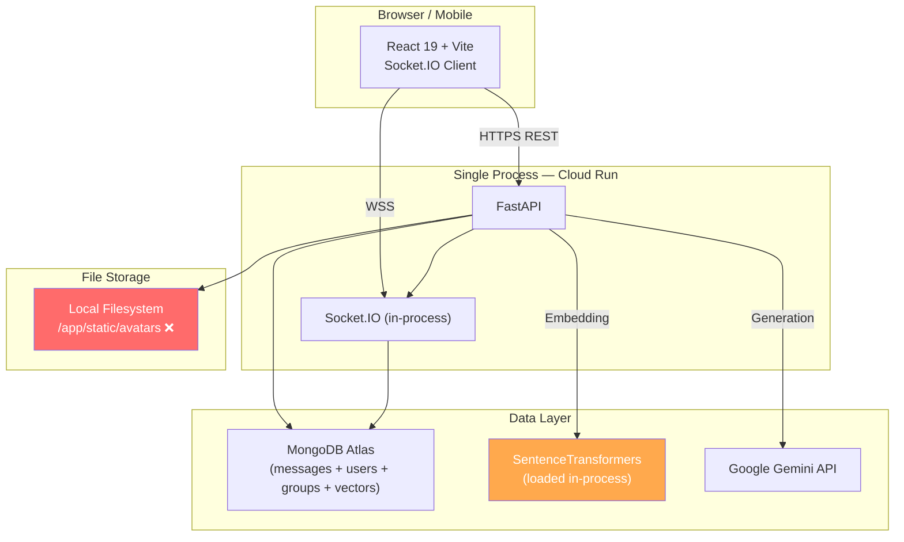

### Critical Production Gaps

| Area | Current State | Risk | Resolution |
|---|---|---|---|
| **Backend** | Python/FastAPI monolith | Can't scale individual concerns | Split into Go + Node.js + Python microservices |
| **Socket.IO adapter** | In-memory | Sessions lost on restart; no horizontal scaling | Memorystore Redis adapter |
| **Message queue** | Direct synchronous calls | AI blocks the socket event loop | Google Cloud Pub/Sub |
| **File storage** | Local filesystem | Files wiped on container restart | Google Cloud Storage |
| **Embedding model** | SentenceTransformers in-process | ~400 MB RAM per pod; cold start > 30s | BGE-M3 in dedicated `nexus-rag` service |
| **AI provider** | Hardcoded Gemini only | Single point of failure; no cost control | Multi-model AI Gateway |
| **Vector search** | MongoDB `$vectorSearch` | Atlas-only vendor lock; no hybrid search | Qdrant Cloud |
| **Authentication** | Custom JWT in localStorage | XSS vulnerable; OTP maintenance burden | Firebase Authentication |
| **Rate limiting** | In-memory dict | Reset on restart; not shared | Memorystore Redis sliding window |
| **Observability** | `print()` / basic `logger` | Zero visibility in production | GCP Cloud Logging/Monitoring/Trace |
| **Security** | No WAF, no secret manager | Exposed to DDoS, secrets in .env | Cloud Armor + Secret Manager |
| **Multi-tenancy** | None | Can't support organizations/teams | `tenant_id` + `workspace_id` everywhere |

---

## 2. Target Production Architecture

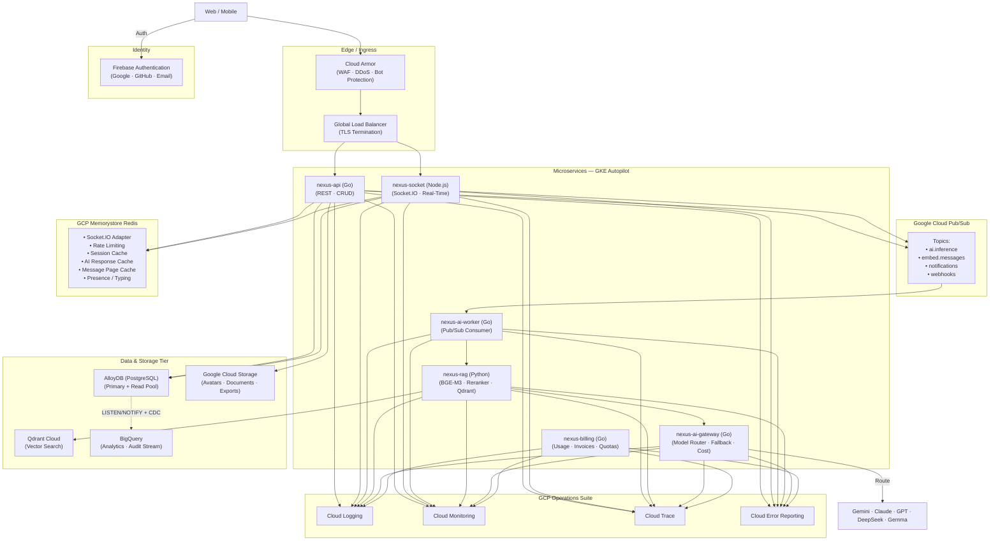

### Technology Stack Summary

| Layer | Technology | Purpose |
|---|---|---|
| **Language** | Go 1.22+ / Node.js 22 / Python 3.12 | Go for API/Gateway/Worker/Billing; Node.js for Socket; Python for RAG |
| **Frontend** | React 19 + Vite | Client SPA |
| **Auth** | Firebase Authentication | Google, GitHub, Email/Password |
| **REST API** | Gin / Echo (Go) | HTTP routing in `nexus-api` |
| **WebSocket** | Socket.IO (Node.js) + `@socket.io/redis-adapter` | Battle-tested real-time in `nexus-socket` |
| **Message Queue** | Google Cloud Pub/Sub | Async AI inference & notifications |
| **Cache** | GCP Memorystore (Redis 7) | Sessions, rate limiting, Socket.IO adapter |
| **Database** | AlloyDB (PostgreSQL) | Multi-tenant persistent data, RLS, ACID billing |
| **Vector DB** | Qdrant Cloud | Semantic search with hybrid retrieval |
| **Object Storage** | Google Cloud Storage (GCS) | Avatars, documents, attachments |
| **Analytics** | BigQuery | Audit logs, usage analytics, billing |
| **CDN** | Cloud CDN | Static assets + GCS file delivery |
| **WAF** | Cloud Armor | DDoS, bot protection, IP filtering |
| **Secrets** | Secret Manager | All sensitive credentials |
| **Monitoring** | Cloud Monitoring | Metrics dashboards, alerting |
| **Logging** | Cloud Logging | Structured JSON logs |
| **Tracing** | Cloud Trace | Distributed request tracing |
| **Errors** | Cloud Error Reporting | Panic/crash grouping & alerts |
| **Billing** | `nexus-billing` (Go) | Token metering, invoice generation, quota enforcement |
| **Container Orchestration** | GKE Autopilot | Fully managed nodes, auto-scaling, per-pod billing |
| **CI/CD** | GitHub Actions + Cloud Build | Lint → Test → Build → Deploy |

---

## 3. Microservices Breakdown

The monolithic FastAPI backend is decomposed into **six** focused microservices across **three languages**, each chosen for its strongest use case:
- **Go** (4 services): API, AI Gateway, AI Worker, Billing — for high concurrency, minimal memory (~10 MB), sub-second cold starts.
- **Node.js** (1 service): Socket — because the official Socket.IO library is battle-tested, feature-complete, and has native Redis adapter support. Go Socket.IO libraries (`googollee/go-socket.io`) are poorly maintained and lack features like auto-reconnection, binary payloads, and namespaces.
- **Python** (1 service): RAG — because BGE-M3, BGE-Reranker, and HuggingFace/PyTorch run natively in Python.

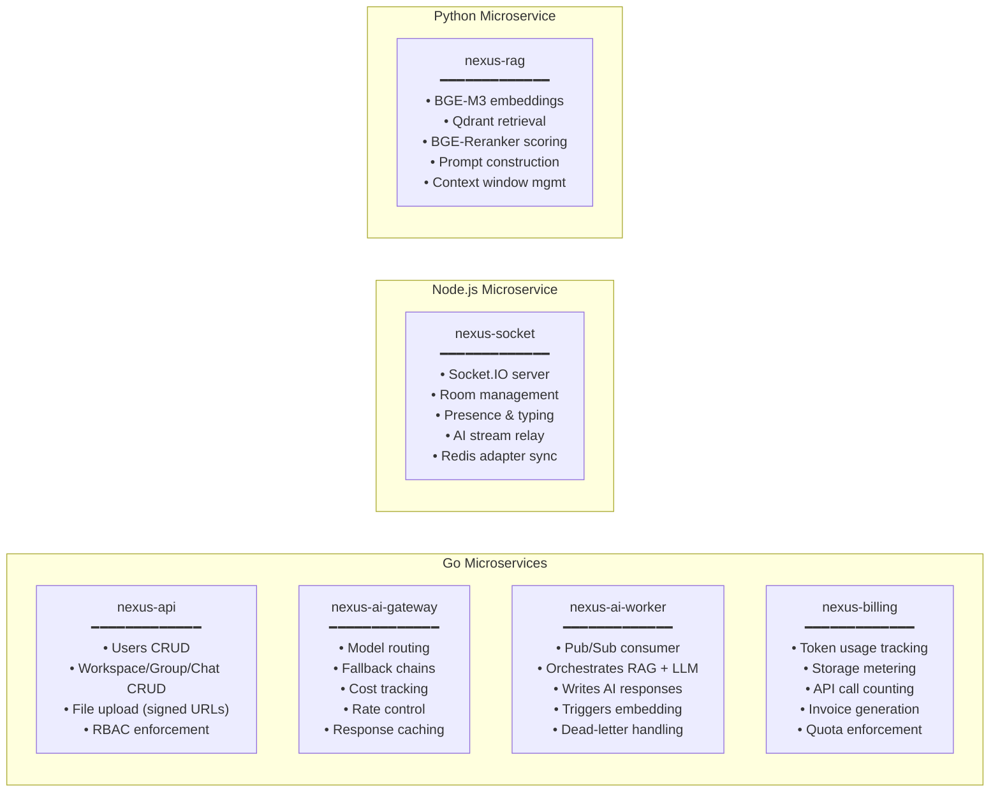

### Service Language Matrix

| Service | Language | Rationale |
|---|---|---|
| `nexus-api` | **Go** | High-throughput REST, minimal memory |
| `nexus-socket` | **Node.js** | Official Socket.IO library; native `@socket.io/redis-adapter`; auto-reconnect, rooms, namespaces |
| `nexus-ai-gateway` | **Go** | Fast HTTP proxy, circuit breakers |
| `nexus-ai-worker` | **Go** | Concurrent Pub/Sub consumer |
| `nexus-billing` | **Go** | High-frequency metering writes |
| `nexus-rag` | **Python** | Native BGE-M3 / BGE-Reranker / PyTorch / HuggingFace |

### Service Communication Matrix

| From → To | Protocol | Purpose |
|---|---|---|
| `nexus-api` → `nexus-socket` | Redis PubSub | Push events to connected clients |
| `nexus-socket` → Pub/Sub | gRPC (Pub/Sub client) | Enqueue AI inference jobs |
| Pub/Sub → `nexus-ai-worker` | Push subscription | Deliver AI tasks to workers |
| `nexus-ai-worker` → `nexus-rag` | gRPC (internal) | Request context retrieval |
| `nexus-rag` → Qdrant Cloud | gRPC / HTTP | Vector similarity search |
| `nexus-ai-worker` → `nexus-ai-gateway` | gRPC (internal) | Request LLM completion |
| `nexus-ai-gateway` → LLM providers | HTTPS | Gemini, Claude, GPT, DeepSeek, Gemma |
| `nexus-ai-gateway` → `nexus-billing` | gRPC (internal) | Report token usage per request |
| `nexus-api` → `nexus-billing` | gRPC (internal) | Check tenant quota before operations |
| `nexus-billing` → BigQuery | Streaming insert | Usage analytics & invoice data |
| `nexus-ai-worker` → Redis PubSub | Redis protocol | Broadcast AI reply to room |
| All services → Memorystore | Redis protocol | Caching, rate limiting, sessions |
| All services → AlloyDB | PostgreSQL wire protocol | Persistent data reads/writes, RLS enforced |

### Service Resource Budgets (GKE Autopilot)

> **Note**: GKE Autopilot automatically provisions node resources based on pod requests. You only define pod-level resource specs — no node pools to manage.

| Service | Language | CPU Request | CPU Limit | Memory Request | Memory Limit | Replicas (HPA) |
|---|---|---|---|---|---|---|
| `nexus-api` | Go | 250m | 1000m | 128Mi | 512Mi | 2 → 10 |
| `nexus-socket` | Node.js | 500m | 2000m | 256Mi | 1Gi | 2 → 10 |
| `nexus-rag` | Python | 1000m | 4000m | 2Gi | 8Gi | 2 → 6 |
| `nexus-ai-gateway` | Go | 250m | 1000m | 128Mi | 512Mi | 2 → 8 |
| `nexus-ai-worker` | Go | 500m | 2000m | 512Mi | 2Gi | 2 → 8 |
| `nexus-billing` | Go | 250m | 1000m | 128Mi | 512Mi | 2 → 4 |

---

## 4. Repository Structure & gRPC Proto

### Mono-Repo Structure

All services, shared protobuf definitions, infrastructure-as-code, and the frontend live in a single repository for atomic commits, shared CI, and simplified dependency management.

```text
nexus/
├── services/
│   ├── nexus-api/              (Go — Gin/Echo)
│   │   ├── cmd/
│   │   ├── internal/
│   │   ├── Dockerfile
│   │   └── go.mod
│   ├── nexus-socket/           (Node.js — Socket.IO)
│   │   ├── src/
│   │   ├── Dockerfile
│   │   └── package.json
│   ├── nexus-ai-gateway/       (Go)
│   │   ├── cmd/
│   │   ├── internal/
│   │   └── go.mod
│   ├── nexus-ai-worker/        (Go)
│   │   ├── cmd/
│   │   ├── internal/
│   │   └── go.mod
│   ├── nexus-billing/          (Go)
│   │   ├── cmd/
│   │   ├── internal/
│   │   └── go.mod
│   └── nexus-rag/              (Python — FastAPI + gRPC)
│       ├── app/
│       ├── Dockerfile
│       └── requirements.txt
├── proto/                      (Shared gRPC definitions)
│   ├── rag/
│   │   └── rag.proto
│   ├── gateway/
│   │   └── gateway.proto
│   ├── billing/
│   │   └── billing.proto
│   └── buf.yaml
├── client/                     (React 19 + Vite)
│   ├── src/
│   └── package.json
├── infra/                      (Terraform / Pulumi)
│   ├── gke/
│   ├── pubsub/
│   ├── memorystore/
│   └── cloudstorage/
├── scripts/
│   ├── migrate/                (Data migration scripts)
│   └── seed/
├── docker-compose.yml          (Local development)
├── Makefile
└── README.md
```

### Shared gRPC Proto Definitions

All inter-service communication uses **Protocol Buffers** managed with **Buf**. Proto files live in `/proto` and are compiled into Go and Python stubs during CI.

```protobuf
// proto/rag/rag.proto
syntax = "proto3";
package nexus.rag;

service RAGService {
  rpc RetrieveContext (RetrieveRequest) returns (RetrieveResponse);
  rpc EmbedAndStore (EmbedRequest) returns (EmbedResponse);
}

message RetrieveRequest {
  string query = 1;
  string tenant_id = 2;
  string group_id = 3;
  string chat_id = 4;
  int32 top_k = 5;
}

message RetrieveResponse {
  repeated ContextChunk chunks = 1;
  int32 total_tokens = 2;
}

message ContextChunk {
  string content = 1;
  float score = 2;
  string source_user_id = 3;
}
```

```protobuf
// proto/gateway/gateway.proto
syntax = "proto3";
package nexus.gateway;

service AIGatewayService {
  rpc GenerateResponse (GenerateRequest) returns (GenerateResponse);
  rpc StreamResponse (GenerateRequest) returns (stream GenerateChunk);
}

message GenerateRequest {
  string prompt = 1;
  string context = 2;
  string model_hint = 3;   // "fast", "quality", "code", or specific model
  string tenant_id = 4;
}

message GenerateResponse {
  string content = 1;
  string model_used = 2;
  int32 prompt_tokens = 3;
  int32 completion_tokens = 4;
}

message GenerateChunk {
  string delta = 1;         // Incremental text chunk
  bool is_final = 2;
  string model_used = 3;
}
```

---

## 5. Multi-Tenant SaaS Data Model

Every document in the system carries `tenant_id` and `workspace_id` to enable strict data isolation for organizations, teams, and enterprise customers.

### Entity Relationship Diagram

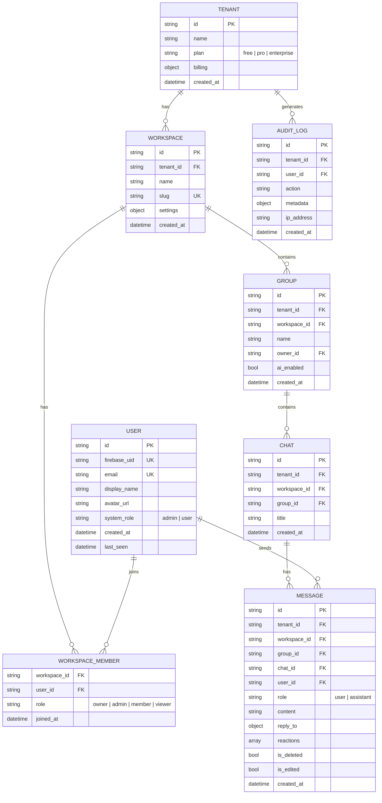

### PostgreSQL Row-Level Security (RLS) & Indexes

```sql
-- RLS Policy (Enforced globally)
ALTER TABLE messages ENABLE ROW LEVEL SECURITY;
CREATE POLICY tenant_isolation ON messages
    USING (tenant_id = current_setting('app.tenant_id')::uuid);

-- Messages (Time-based Partitioning + JSONB for flexible schema)
-- Note: Table is created with PARTITION BY RANGE (created_at)
-- e.g., messages_2026_01, messages_2026_02
CREATE INDEX idx_msg_room_time ON messages(tenant_id, group_id, chat_id, created_at DESC);
CREATE INDEX idx_msg_fulltext ON messages USING GIN(to_tsvector('english', content));

-- Users
CREATE UNIQUE INDEX idx_users_firebase_uid ON users(firebase_uid);
CREATE UNIQUE INDEX idx_users_email ON users(email);

-- Workspaces
CREATE INDEX idx_workspaces_tenant ON workspaces(tenant_id);
CREATE UNIQUE INDEX idx_workspaces_slug ON workspaces(slug);

-- Groups
CREATE INDEX idx_groups_tenant_workspace ON groups(tenant_id, workspace_id);

-- Audit Logs (Time-based partitioning for TTL)
CREATE INDEX idx_audit_tenant_user_time ON audit_logs(tenant_id, user_id, created_at DESC);
```

### RBAC Permissions

| Action | Owner | Admin | Member | Viewer |
|---|---|---|---|---|
| Delete workspace | ✅ | ❌ | ❌ | ❌ |
| Manage billing | ✅ | ❌ | ❌ | ❌ |
| Delete group/chat | ✅ | ✅ | ❌ | ❌ |
| Remove member | ✅ | ✅ | ❌ | ❌ |
| Invite member | ✅ | ✅ | ✅ | ❌ |
| Send message | ✅ | ✅ | ✅ | ❌ |
| Read messages | ✅ | ✅ | ✅ | ✅ |
| Toggle AI | ✅ | ✅ | ❌ | ❌ |

---

## 6. Real-Time Messaging Flow

### Non-Blocking AI with Pub/Sub + Streaming

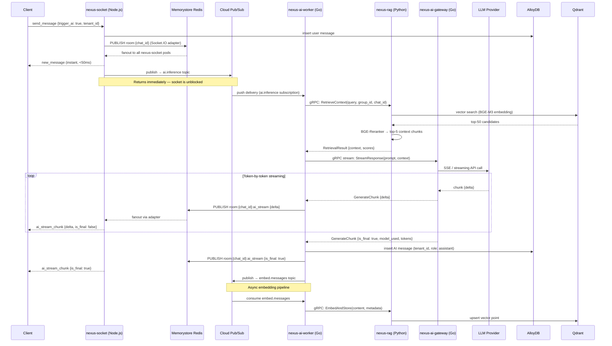

### Socket.IO Horizontal Scaling via Redis Adapter

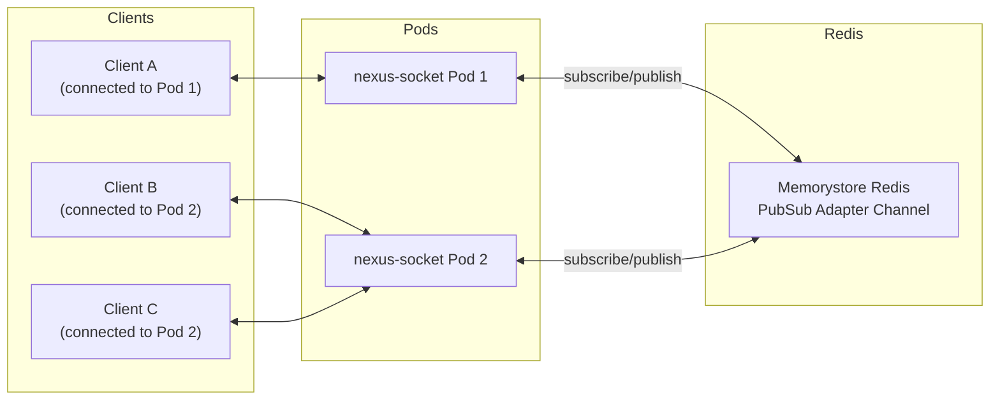

When Pod 1 emits to room `grp:chat_id`, Redis broadcasts the event to Pod 2 as well. All clients in the room receive the message regardless of which pod they are connected to.

---

## 7. AI Streaming Response Architecture

Users expect a **typewriter-style streaming effect** when AI responds, not a 5-15 second blank wait. The architecture supports token-by-token streaming from LLM provider all the way to the browser.

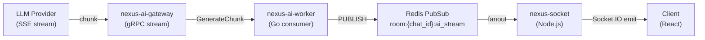

### Client-Side Handling

```javascript
// client/src/hooks/useAIStream.ts
socket.on('ai_stream_chunk', ({ chatId, delta, isFinal, messageId }) => {
  if (isFinal) {
    // Mark message as complete, stop typing indicator
    dispatch({ type: 'AI_STREAM_COMPLETE', chatId, messageId });
  } else {
    // Append delta to the in-progress AI message
    dispatch({ type: 'AI_STREAM_DELTA', chatId, messageId, delta });
  }
});
```

### How It Works End-to-End

1. **LLM Provider** streams tokens via SSE (OpenAI, Anthropic) or chunked response (Gemini).
2. **`nexus-ai-gateway`** receives the stream and forwards each chunk via **gRPC server streaming** (`StreamResponse` RPC).
3. **`nexus-ai-worker`** receives each `GenerateChunk` and publishes it to a Redis PubSub channel `room:{chat_id}:ai_stream`.
4. **`nexus-socket`** (Node.js) receives the Redis message via the adapter and emits `ai_stream_chunk` to all clients in the room.
5. **Client** renders tokens progressively with a typing animation.
6. When `is_final: true` arrives, the worker inserts the complete message into AlloyDB.

---

## 8. Authentication — Firebase

Custom JWT validation, password hashing, and OTP systems are **completely replaced** by Firebase Authentication.

```mermaid
    sequenceDiagram
    participant C as Client (React)
    participant FB as Firebase Auth
    participant API as nexus-api (Go)
    participant RED as Memorystore Redis
    participant M as AlloyDB
    participant SIO as Socket.IO Server
    Note over C,M: Login
    C->>FB: signInWithPopup(GoogleAuthProvider)
    FB-->>C: Firebase ID Token (JWT)
    C->>API: POST /api/auth/session {id_token}
    API->>FB: admin.VerifyIDToken(id_token)
    FB-->>API: decoded {uid, email, name, picture}
    API->>M: upsert user (firebase_uid → user profile)
    API->>RED: SET session:{uid} → user_data (EX 900)
    API-->>C: Set-Cookie: session_token&#59; HttpOnly&#59; Secure&#59; SameSite=Strict
    Note over C,M: Authenticated Request
    C->>API: GET /api/workspaces (cookie sent automatically)
    API->>RED: GET session:{uid} (cache hit → <1ms)
    RED-->>API: user_data
    API->>M: query workspaces (tenant_id filter)
    API-->>C: 200 workspaces[]
    Note over C,SIO: WebSocket Auth
    C->>SIO: connect {auth: {token: firebase_id_token}}
    SIO->>FB: admin.VerifyIDToken(token)
    FB-->>SIO: valid → allow connection
```

### Supported Providers
- **Google OAuth** — Primary enterprise SSO.
- **GitHub OAuth** — Developer-facing login.
- **Email/Password** — Fallback with Firebase-managed password reset and email verification.

### Why Firebase over Custom JWT?
| Concern | Custom JWT | Firebase Auth |
|---|---|---|
| Password storage | You manage hashing (bcrypt) | Firebase handles it |
| OAuth integration | Manual per-provider | Built-in |
| Email verification | Build OTP system | Free, automatic |
| Token refresh | Build rotation logic | Firebase SDK handles it |
| MFA | Build from scratch | One config toggle |
| Security patching | Your responsibility | Google's responsibility |

---

## 9. AI Gateway — Multi-Model Routing

### `nexus-ai-gateway` Service

A centralized Go proxy service acting as the **single egress point** for all LLM interactions across the entire platform.

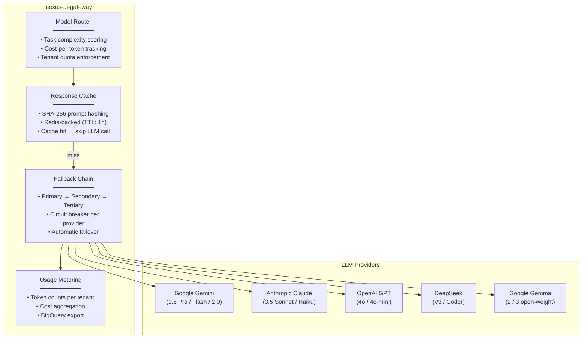

### Model Routing Strategy

| Task Type | Primary Model | Fallback | Rationale |
|---|---|---|---|
| Simple Q&A / chat | Gemma 3 / DeepSeek V3 | Gemini Flash | Low cost, fast |
| Complex reasoning | Gemini 1.5 Pro | Claude 3.5 Sonnet | High quality |
| Code generation | DeepSeek Coder | GPT-4o | Specialized |
| Summarization | Gemini Flash | Claude Haiku | Speed + cost |
| Enterprise / sensitive | Claude 3.5 Sonnet | GPT-4o | Safety filters |

### Circuit Breaker Logic
Each provider is wrapped in a circuit breaker (Go `sony/gobreaker`):
- **Closed** (healthy): Requests flow normally.
- **Open** (tripped): After 5 consecutive failures, stop sending for 30s → route to fallback.
- **Half-Open**: After cooldown, let 1 request through to test recovery.

---

## 10. RAG Pipeline — Dedicated Retrieval Service

### `nexus-rag` Service (Python)

Instead of a simplistic `API → Qdrant → LLM` flow, the retrieval pipeline is professionalized into a **multi-stage pipeline** running inside a dedicated **Python** service (FastAPI + gRPC). Python is chosen here because BGE-M3, BGE-Reranker, and the entire HuggingFace/PyTorch inference stack run natively in Python without CGo overhead.

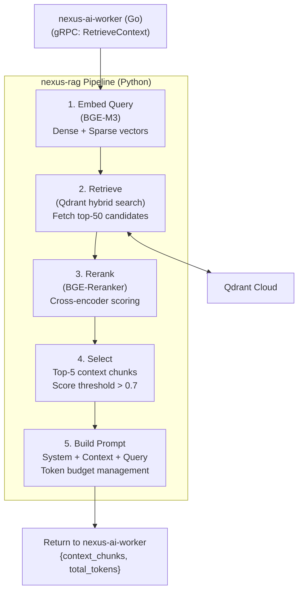

### Models Used

| Component | Model | Purpose |
|---|---|---|
| Embedder | **BGE-M3** | Multilingual, multi-granularity; produces dense + sparse vectors for hybrid search |
| Reranker | **BGE-Reranker-v2-m3** | Cross-encoder that scores query-document relevance with high accuracy |
| Vector DB | **Qdrant Cloud** | HNSW indexing, payload filtering, named vectors, built-in quantization |

### Qdrant Collection Schema

```json
{
  "collection_name": "nexus_messages",
  "vectors_config": {
    "dense": { "size": 1024, "distance": "Cosine" },
    "sparse": { "index": { "on_disk": true } }
  },
  "payload_schema": {
    "tenant_id":    "keyword",
    "workspace_id": "keyword",
    "group_id":     "keyword",
    "chat_id":      "keyword",
    "user_id":      "keyword",
    "role":         "keyword",
    "content":      "text",
    "created_at":   "integer"
  }
}
```

All vector searches are **pre-filtered** by `tenant_id` + `group_id` + `chat_id` to ensure strict multi-tenant data isolation at the vector layer.

---

## 11. Caching Strategy — GCP Memorystore Redis

**GCP Memorystore for Redis** (managed Redis 7) serves as the unified caching, pub/sub, and rate limiting layer.

### Cache Taxonomy

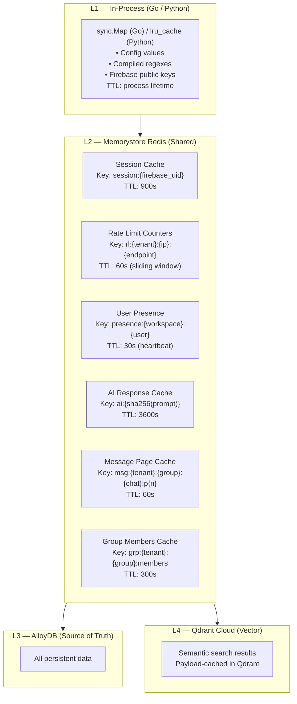

### Redis Key Schema (Complete)

```text
# ── Sessions ──
session:{firebase_uid}                → JSON user payload        EX 900
session:{firebase_uid}:perms          → JSON RBAC permissions    EX 900

# ── Rate Limiting (Sorted Set — Sliding Window) ──
rl:{tenant_id}:{ip}:{endpoint}        → ZSET of timestamps      EX 60
rl:ai:{tenant_id}:{user_id}           → ZSET of timestamps      EX 3600

# ── Presence ──
presence:{workspace_id}:{user_id}     → {status, room, ts}      EX 30
typing:{chat_id}:{user_id}            → "1"                     EX 5

# ── Socket.IO Adapter ──
nexus-sio:{channel}                   → PubSub adapter channels

# ── AI Response Cache ──
ai:{sha256(prompt[:512])}             → {answer, model, tokens}  EX 3600

# ── Message Pages ──
msg:{tenant}:{group}:{chat}:p{n}      → JSON messages[]          EX 60

# ── Group Membership ──
grp:{tenant}:{group}:members          → JSON members[]           EX 300
```

### Cache-Aside Pattern

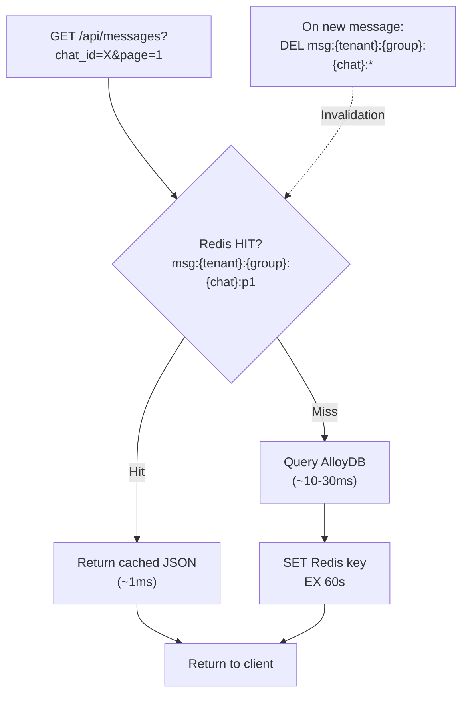

---

## 12. Database Layer — AlloyDB (PostgreSQL)

### Cluster Configuration
- **Engine**: AlloyDB for PostgreSQL (fully managed, highly available).
- **Topology**: Primary instance for writes + auto-scaling read pool.
- **Features**: 4x faster reads than standard Postgres, built-in columnar engine for analytical queries, native Row-Level Security (RLS).

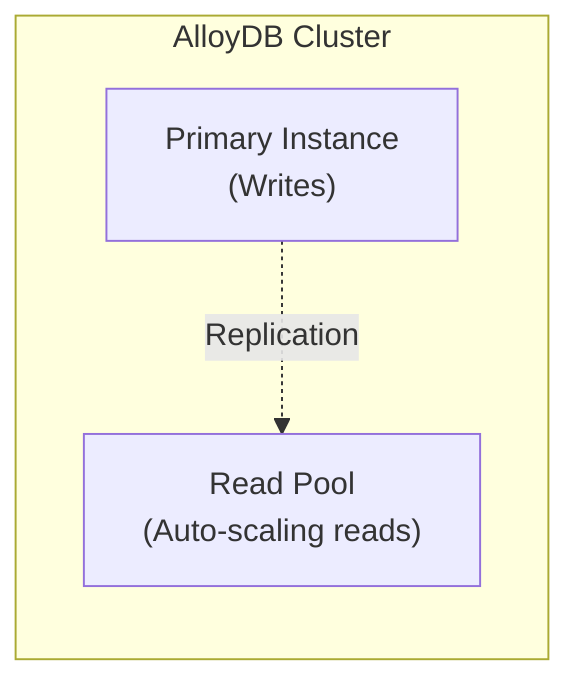

### Go Database Client Configuration (pgx)

```go
// internal/database/postgres.go
func NewPostgresPool(ctx context.Context) (*pgxpool.Pool, error) {
    config, err := pgxpool.ParseConfig(os.Getenv("ALLOYDB_URI"))
    if err != nil {
        return nil, err
    }
    
    config.MaxConns = 100
    config.MinConns = 10
    config.MaxConnIdleTime = time.Minute * 5
        
    pool, err := pgxpool.NewWithConfig(ctx, config)
    if err != nil {
        return nil, err
    }
    return pool, nil
}
```

---

## 13. Vector Search — Qdrant Cloud

### Why Qdrant over MongoDB Atlas Vector Search?

| Feature | MongoDB Atlas VS | Qdrant Cloud |
|---|---|---|
| Hybrid search (dense + sparse) | ❌ | ✅ |
| Pre-filter before search | Limited | ✅ Full payload filtering |
| Query latency (1M vectors) | ~50-100ms | ~5-10ms (HNSW) |
| Quantization | ❌ | ✅ Binary / Scalar / Product |
| Multi-vector support | ❌ | ✅ Named vectors |
| Vendor lock-in | Atlas-only | Self-hosted or cloud |
| Cost at scale | High (Atlas tier) | Lower |

### Migration Path
1. Deploy Qdrant Cloud cluster in same GCP region.
2. `nexus-rag` service embeds all existing messages via BGE-M3.
3. Upsert vectors to Qdrant with full payload (tenant_id, group_id, etc.).
4. Switch `nexus-rag` retrieval to Qdrant.
5. Remove Atlas Vector Search indexes.

---

## 14. File Storage — Google Cloud Storage

### Bucket Structure

```text
gs://nexus-prod-storage/
├── avatars/{tenant_id}/{user_id}/{timestamp}.webp
├── avatars/{tenant_id}/{user_id}/{timestamp}_thumb.webp
├── documents/{tenant_id}/{workspace_id}/
├── attachments/{tenant_id}/{chat_id}/{message_id}/
├── exports/{tenant_id}/{export_id}.zip
└── workspace-files/{tenant_id}/{workspace_id}/
```

### Upload Flow

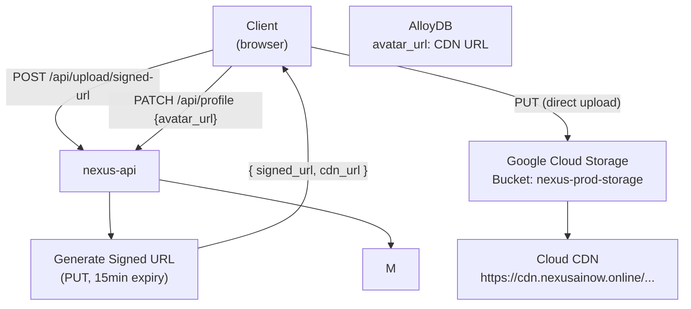

**Key design**: The client uploads **directly to GCS** via a signed URL. The API server never touches the file bytes, keeping it lightweight.

### CDN Serving
All GCS objects are served through **Cloud CDN** with:
- `Cache-Control: public, max-age=31536000` for immutable assets.
- Signed URLs for private/temporary downloads.

---

## 15. Async Job Processing — Google Cloud Pub/Sub

### Topic & Subscription Architecture

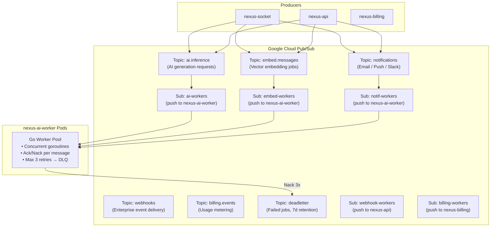

### Go Pub/Sub Consumer

```go
// internal/worker/consumer.go
func (w *Worker) Start(ctx context.Context) error {
    sub := w.pubsubClient.Subscription("ai-workers")
    sub.ReceiveSettings.MaxOutstandingMessages = 10
    sub.ReceiveSettings.NumGoroutines = 5

    return sub.Receive(ctx, func(ctx context.Context, msg *pubsub.Message) {
        var task AIInferenceTask
        if err := json.Unmarshal(msg.Data, &task); err != nil {
            log.Error("invalid message", "error", err)
            msg.Ack() // Don't retry malformed messages
            return
        }

        attempt := msg.DeliveryAttempt
        if err := w.processInference(ctx, task); err != nil {
            if attempt != nil && *attempt >= 3 {
                w.sendToDeadLetter(ctx, msg, err)
                msg.Ack()
            } else {
                msg.Nack() // Pub/Sub will retry with backoff
            }
            return
        }
        msg.Ack()
    })
}
```

### Why Pub/Sub over Kafka / Redis Streams?

| Feature | Google Pub/Sub | Kafka | Redis Streams |
|---|---|---|---|
| Ops burden | Zero (fully managed) | High (ZooKeeper/KRaft) | Moderate |
| Auto-scaling | ✅ Infinite | Manual partition tuning | Manual |
| Dead-letter queues | ✅ Native | Manual topic setup | Manual |
| Retry with backoff | ✅ Built-in | Consumer-side logic | Consumer-side logic |
| GCP integration | ✅ Native IAM, logging | N/A | N/A |
| Cost at moderate scale | Low (pay per message) | High (always-on brokers) | Moderate |
| Delivery guarantee | At-least-once | At-least-once / Exactly-once | At-least-once |

---

## 16. API Gateway & Rate Limiting

### Rate Limiting Tiers (Redis Sliding Window)

| Tier | Limit | Window | Redis Key |
|---|---|---|---|
| Unauthenticated | 20 req | 60s | `rl:anon:{ip}` |
| Authenticated REST | 120 req | 60s | `rl:{tenant}:{user}:rest` |
| AI inference | 20 req | 3600s | `rl:ai:{tenant}:{user}` |
| Socket events | 5 events | 1s | `rl:ws:{sid}` |
| File upload | 10 req | 3600s | `rl:upload:{tenant}:{user}` |
| Auth endpoints | 5 req | 300s | `rl:auth:{ip}` |

### Rate Limiter Implementation (Go)

```go
// internal/middleware/ratelimit.go
func CheckRateLimit(ctx context.Context, rdb *redis.Client,
    key string, maxCalls int, windowSec int64) error {
    
    now := float64(time.Now().UnixNano()) / 1e9
    pipe := rdb.Pipeline()
    
    pipe.ZRemRangeByScore(ctx, key, "0", fmt.Sprintf("%f", now-float64(windowSec)))
    pipe.ZAdd(ctx, key, redis.Z{Score: now, Member: fmt.Sprintf("%f", now)})
    countCmd := pipe.ZCard(ctx, key)
    pipe.Expire(ctx, key, time.Duration(windowSec)*time.Second)
    
    if _, err := pipe.Exec(ctx); err != nil {
        return err
    }
    
    if countCmd.Val() > int64(maxCalls) {
        return ErrRateLimitExceeded
    }
    return nil
}
```

### Circuit Breaker for External APIs

Each external service call (LLM providers, Qdrant, Firebase) is wrapped using `sony/gobreaker`:

```go
cb := gobreaker.NewCircuitBreaker(gobreaker.Settings{
    Name:        "gemini-api",
    MaxRequests: 1,                       // Half-open: allow 1 test request
    Interval:    60 * time.Second,        // Reset failure count window
    Timeout:     30 * time.Second,        // Open → Half-open cooldown
    ReadyToTrip: func(counts gobreaker.Counts) bool {
        return counts.ConsecutiveFailures > 5
    },
})
```

---

## 17. Security, GDPR & Compliance

### Security Architecture

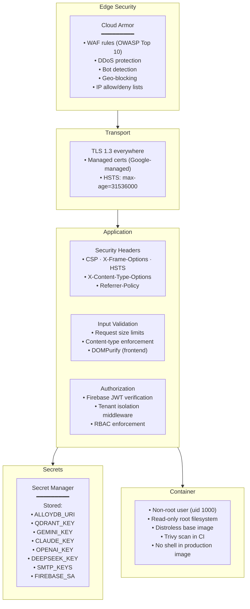

### GDPR & Data Compliance

As a multi-tenant SaaS serving enterprise customers, Nexus must comply with GDPR and regional data protection laws.

| Requirement | Implementation |
|---|---|
| **Right to Access** (Art. 15) | `GET /api/tenant/{id}/export` — generates a ZIP of all tenant data from AlloyDB + Qdrant + GCS |
| **Right to Erasure** (Art. 17) | `DELETE /api/tenant/{id}` — cascading delete across AlloyDB, Qdrant vectors, GCS files, BigQuery rows, and Redis cache |
| **Right to Portability** (Art. 20) | Export in JSON/CSV format via `nexus-api` |
| **Data Residency** | Deploy tenant data in region-specific AlloyDB clusters and GCS buckets (e.g., `eu-west1` for EU tenants) |
| **Data Processing Agreement** | Template DPA available for enterprise tenants |
| **Consent Management** | Firebase Auth handles consent for OAuth; custom consent tracking in `audit_logs` |
| **Breach Notification** | Cloud Error Reporting + PagerDuty alert within 72 hours |
| **Data Minimization** | TTL on audit_logs (90 days), message soft-delete with hard purge after 30 days |

### Tenant Data Deletion Flow

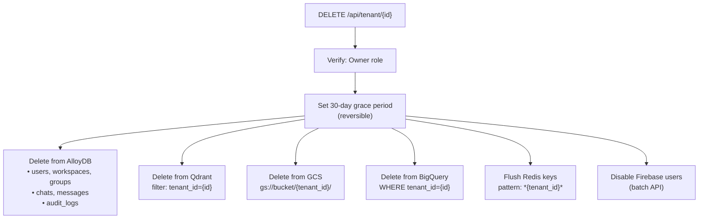

### Security Headers Middleware (Go)

```go
// internal/middleware/security.go
func SecurityHeaders() gin.HandlerFunc {
    return func(c *gin.Context) {
        c.Header("Strict-Transport-Security", "max-age=31536000; includeSubDomains; preload")
        c.Header("X-Content-Type-Options", "nosniff")
        c.Header("X-Frame-Options", "DENY")
        c.Header("X-XSS-Protection", "1; mode=block")
        c.Header("Referrer-Policy", "strict-origin-when-cross-origin")
        c.Header("Permissions-Policy", "camera=(), microphone=(), geolocation=()")
        c.Header("Content-Security-Policy",
            "default-src 'self'; "+
            "script-src 'self'; "+
            "style-src 'self' 'unsafe-inline'; "+
            "img-src 'self' https://cdn.nexusainow.online data:; "+
            "connect-src 'self' wss://*.nexusainow.online;")
        c.Next()
    }
}
```

---

## 18. Backup & Disaster Recovery

### Backup Strategy

| Component | Backup Method | Frequency | Retention | RTO | RPO |
|---|---|---|---|---|---|
| **AlloyDB** | Continuous backup + point-in-time recovery | Continuous | 14 days PITR, 30 days snapshots | 1 hour | 1 minute |
| **Qdrant Cloud** | Scheduled snapshots | Every 6 hours | 7 days | 2 hours | 6 hours |
| **Google Cloud Storage** | Object versioning + multi-region replication | Continuous | 30 days versioning | Near-instant | 0 (multi-region) |
| **BigQuery** | Time-travel queries + dataset snapshots | Continuous | 7 days time-travel | Near-instant | 0 |
| **Memorystore Redis** | RDB snapshots | Every 12 hours | 3 days | 30 minutes | 12 hours |
| **Secret Manager** | Version history | Every change | All versions | Near-instant | 0 |

### Disaster Recovery Plan

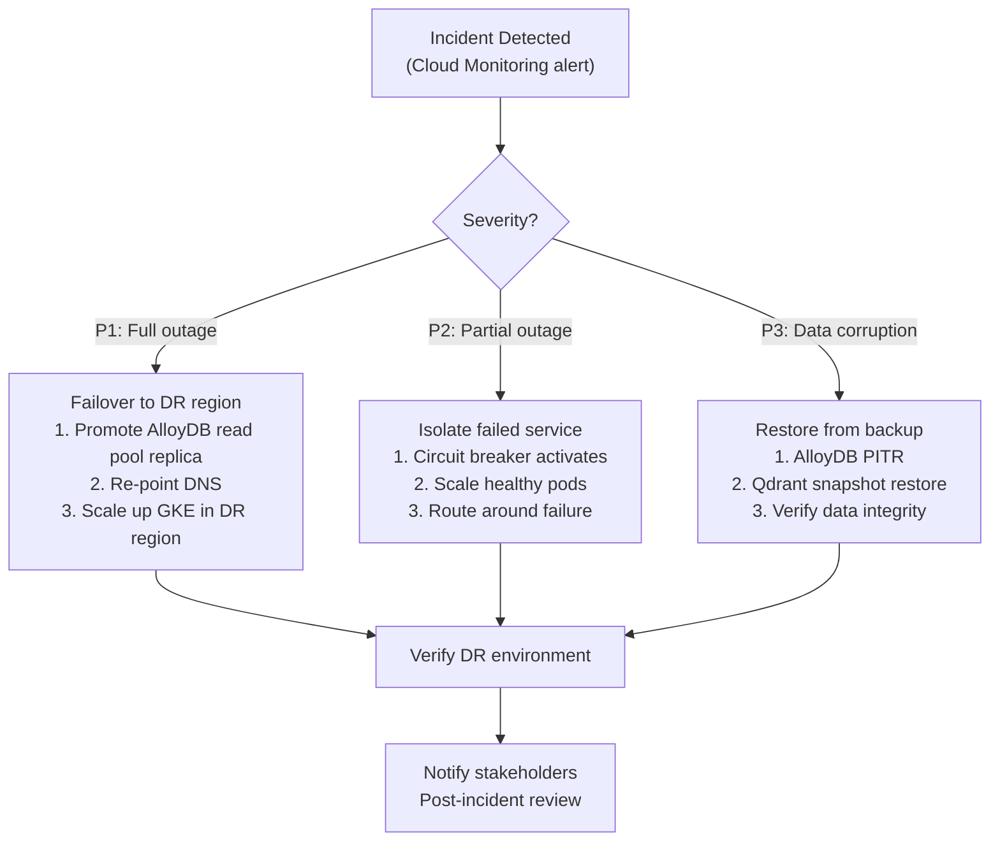

### Recovery Time Objectives

| Scenario | RTO Target | RPO Target |
|---|---|---|
| Single service failure | < 5 minutes (HPA auto-heal) | 0 |
| Full region outage | < 1 hour | < 1 minute (AlloyDB PITR) |
| Database corruption | < 2 hours | < 1 minute |
| Accidental data deletion | < 30 minutes | < 1 minute |

---

## 19. Observability — GCP Operations Suite

All six microservices are natively integrated with GCP's managed observability stack. **No self-hosted Prometheus, Grafana, or Loki to maintain.**

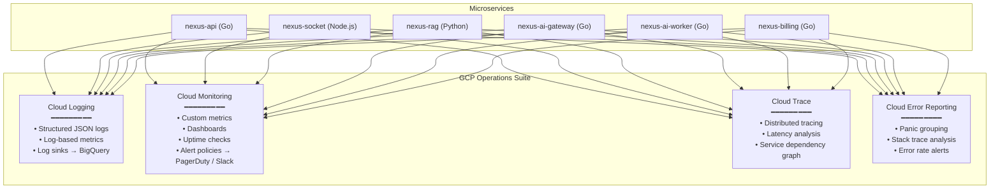

### Key Metrics to Track

| Metric | Source | Alert Threshold |
|---|---|---|
| Request latency (p95) | `nexus-api` | > 500ms |
| Active WebSocket connections | `nexus-socket` | > 10,000 per pod |
| AI inference latency | `nexus-ai-worker` | > 15s |
| Pub/Sub undelivered messages | Cloud Monitoring | > 100 for 5min |
| Cache hit rate | Memorystore | < 70% |
| Error rate (5xx) | All services | > 1% for 5min |
| Qdrant search latency | `nexus-rag` | > 100ms |
| LLM token cost per hour | `nexus-ai-gateway` | > $50/hr |
| Billing sync lag | `nexus-billing` | > 60s |
| Tenant quota breaches | `nexus-billing` | any |

### Structured Logging Format (Go)

```go
// internal/logging/logger.go
import "cloud.google.com/go/logging"

type LogEntry struct {
    Severity  string `json:"severity"`
    Message   string `json:"message"`
    Service   string `json:"service"`
    TraceID   string `json:"logging.googleapis.com/trace,omitempty"`
    SpanID    string `json:"logging.googleapis.com/spanId,omitempty"`
    TenantID  string `json:"tenant_id,omitempty"`
    UserID    string `json:"user_id,omitempty"`
    RequestID string `json:"request_id,omitempty"`
    Latency   string `json:"latency,omitempty"`
}
```

---

## 20. CI/CD Pipeline

```mermaid
flowchart LR
    subgraph Dev["Developer"]
        CODE["Push to feature/*"]
    end

    subgraph PR["Pull Request Checks"]
        LINT["golangci-lint (Go)\n+ ESLint (Node.js + React)\n+ ruff (Python)"]
        TEST["go test + jest + pytest\ncoverage > 80%"]
        SCAN["Trivy container scan\ngosec + bandit SAST"]
    end

    subgraph Staging["Merge → develop"]
        BUILD_S["Docker build\n(distroless multi-stage)"]
        PUSH_S["Push to Artifact Registry"]
        DEPLOY_S["Deploy to GKE Autopilot staging"]
        SMOKE["Smoke tests\n+ Playwright E2E"]
    end

    subgraph Prod["Tag → vX.Y.Z"]
        DEPLOY_P["Canary: 10% → 50% → 100%"]
        MONITOR["Watch error rate\n+ p95 latency (10min)"]
        ROLLBACK["Auto-rollback\nif error rate > 1%"]
    end

    CODE --> LINT --> TEST --> SCAN
    SCAN -->|merged| BUILD_S --> PUSH_S --> DEPLOY_S --> SMOKE
    SMOKE -->|tagged| DEPLOY_P --> MONITOR
    MONITOR -->|ok| DONE["✅ Production"]
    MONITOR -->|fail| ROLLBACK
```

### Dockerfile (Multi-Stage Distroless)

```dockerfile
# ── Build stage ──
FROM golang:1.22-alpine AS builder
WORKDIR /app
COPY go.mod go.sum ./
RUN go mod download
COPY . .
RUN CGO_ENABLED=0 GOOS=linux go build -ldflags="-s -w" -o /server ./cmd/api

# ── Production stage ──
FROM gcr.io/distroless/static-debian12:nonroot
COPY --from=builder /server /server
USER nonroot:nonroot
EXPOSE 8080
ENTRYPOINT ["/server"]
```

### Dockerfile — nexus-rag (Python)

```dockerfile
# ── Build stage ──
FROM python:3.12-slim AS builder
WORKDIR /app
COPY requirements.txt .
RUN pip install --no-cache-dir -r requirements.txt
COPY . .

# ── Production stage ──
FROM python:3.12-slim
WORKDIR /app
COPY --from=builder /usr/local/lib/python3.12 /usr/local/lib/python3.12
COPY --from=builder /app /app
USER 1000:1000
EXPOSE 50051
CMD ["python", "-m", "app.main"]
```

### Dockerfile — nexus-socket (Node.js)

```dockerfile
FROM node:22-alpine AS builder
WORKDIR /app
COPY package*.json ./
RUN npm ci --production
COPY . .

FROM node:22-alpine
WORKDIR /app
COPY --from=builder /app .
USER node
EXPOSE 3000
CMD ["node", "src/index.js"]
```

---

## 21. Local Development Environment

Developers can spin up the entire stack locally with a single command using Docker Compose.

```yaml
# docker-compose.yml
version: '3.9'

services:
  # ── Infrastructure ──
  redis:
    image: redis:7-alpine
    ports: ['6379:6379']

  postgres:
    image: postgres:16-alpine
    ports: ['5432:5432']
    environment:
      POSTGRES_DB: nexus
      POSTGRES_USER: root
      POSTGRES_PASSWORD: rootpassword

  qdrant:
    image: qdrant/qdrant:latest
    ports: ['6333:6333', '6334:6334']

  pubsub-emulator:
    image: gcr.io/google.com/cloudsdktool/cloud-sdk:latest
    command: gcloud beta emulators pubsub start --host-port=0.0.0.0:8085
    ports: ['8085:8085']

  # ── Services ──
  nexus-api:
    build: ./services/nexus-api
    ports: ['8080:8080']
    env_file: .env.local
    depends_on: [redis, postgres]

  nexus-socket:
    build: ./services/nexus-socket
    ports: ['3000:3000']
    env_file: .env.local
    depends_on: [redis, postgres]

  nexus-rag:
    build: ./services/nexus-rag
    ports: ['50051:50051']
    env_file: .env.local
    depends_on: [qdrant]

  nexus-ai-gateway:
    build: ./services/nexus-ai-gateway
    ports: ['8081:8081']
    env_file: .env.local

  nexus-ai-worker:
    build: ./services/nexus-ai-worker
    env_file: .env.local
    depends_on: [redis, postgres, pubsub-emulator, nexus-rag, nexus-ai-gateway]

  nexus-billing:
    build: ./services/nexus-billing
    ports: ['8082:8082']
    env_file: .env.local
    depends_on: [redis, postgres]

  # ── Frontend ──
  client:
    build: ./client
    ports: ['5173:5173']
    depends_on: [nexus-api, nexus-socket]
```

**Quick start:**
```bash
cp .env.example .env.local
docker compose up -d
# API:     http://localhost:8080
# Socket:  http://localhost:3000
# Client:  http://localhost:5173
# Qdrant:  http://localhost:6333/dashboard
```

---

## 22. Deployment Topology

```mermaid
graph TB
    subgraph GCP["Google Cloud Platform"]
        subgraph Edge["Edge"]
            ARMOR["Cloud Armor (WAF)"]
            GLB["Global Load Balancer"]
            CDN["Cloud CDN"]
        end

        subgraph GKE["GKE Autopilot Cluster"]
            subgraph NSapi["Namespace: nexus-services"]
                D_API["nexus-api (Go)\n(2-10 pods, HPA)"]
                D_SIO["nexus-socket (Node.js)\n(2-10 pods, HPA)"]
                D_BILL["nexus-billing (Go)\n(2-4 pods, HPA)"]
            end
            subgraph NSai["Namespace: nexus-ai"]
                D_RAG["nexus-rag (Python)\n(2-6 pods, HPA)"]
                D_AIGW["nexus-ai-gateway (Go)\n(2-8 pods, HPA)"]
                D_WRK["nexus-ai-worker (Go)\n(2-8 pods, HPA)"]
            end
        end

        subgraph Managed["GCP Managed Services"]
            PDB["AlloyDB Cluster\n(Primary + Read Pool)"]
            MEM["Memorystore Redis\n(HA, 2 replicas)"]
            PS["Cloud Pub/Sub\n(4 topics, 4 subs, 1 DLQ)"]
            GCS["Cloud Storage\n(multi-region bucket)"]
            SM["Secret Manager"]
            LOGS["Cloud Logging / Monitoring\n/ Trace / Error Reporting"]
        end
    end

    subgraph ThirdParty["Third-Party Managed"]
        QDR["Qdrant Cloud\n(production cluster)"]
        FBA["Firebase Auth"]
        LLMs["Gemini · Claude · GPT\nDeepSeek · Gemma"]
    end

    ARMOR --> GLB
    GLB --> CDN
    GLB --> GKE
    GKE --> Managed
    GKE --> ThirdParty
```

---

## 23. Environment Variables & Secrets

All secrets are stored in **Google Secret Manager** and mounted into pods at startup via GKE Autopilot Workload Identity.

| Secret Name | Service(s) | Description |
|---|---|---|
| `ALLOYDB_URI` | All | AlloyDB connection string |
| `QDRANT_URL` | `nexus-rag` | Qdrant Cloud endpoint |
| `QDRANT_API_KEY` | `nexus-rag` | Qdrant auth key |
| `GEMINI_API_KEY` | `nexus-ai-gateway` | Google Gemini key |
| `CLAUDE_API_KEY` | `nexus-ai-gateway` | Anthropic key |
| `OPENAI_API_KEY` | `nexus-ai-gateway` | OpenAI key |
| `DEEPSEEK_API_KEY` | `nexus-ai-gateway` | DeepSeek key |
| `FIREBASE_SA_JSON` | `nexus-api`, `nexus-socket` | Firebase Admin SDK service account |
| `REDIS_URL` | All | Memorystore connection string |
| `GCS_BUCKET` | `nexus-api` | Cloud Storage bucket name |
| `STRIPE_SECRET_KEY` | `nexus-billing` | Stripe payment processing |
| `SMTP_HOST` | `nexus-ai-worker` | Email notification credentials |
| `SMTP_KEY` | `nexus-ai-worker` | Email API key |

### Non-Secret Config (Environment Variables)

```bash
# Service identity
SERVICE_NAME=nexus-api          # Per service
GCP_PROJECT=nexus-prod
GCP_REGION=us-central1

# Feature flags
AI_ENABLED=true
MAX_CONTEXT_TOKENS=4096
MAX_UPLOAD_SIZE_MB=50

# Pub/Sub topics
PUBSUB_TOPIC_AI=ai.inference
PUBSUB_TOPIC_EMBED=embed.messages
PUBSUB_TOPIC_NOTIF=notifications
PUBSUB_TOPIC_BILLING=billing.events
PUBSUB_TOPIC_DLQ=deadletter

# Redis
REDIS_MAX_POOL=50

# Cookie
COOKIE_DOMAIN=.nexusainow.online
COOKIE_SECURE=true
```

---

## 24. Cost Estimation

### Monthly Cost Projection (Moderate Scale: ~10K MAU)

| Service | Tier / Spec | Estimated Monthly Cost |
|---|---|---|
| **GKE Autopilot** | ~20 pods average | $400 – $600 |
| **Memorystore Redis** | Standard, 5GB, HA | $150 – $200 |
| **Cloud Pub/Sub** | ~5M messages/month | $10 – $20 |
| **Cloud Storage** | 100GB, multi-region | $5 – $10 |
| **Cloud CDN** | 500GB egress | $40 – $60 |
| **Cloud Armor** | Standard tier | $5 + $1/rule |
| **Cloud Logging/Monitoring** | 50GB logs ingestion | $25 – $50 |
| **Cloud Trace** | First 2.5M spans free | $0 – $10 |
| **Secret Manager** | <100 secrets, <10K accesses | $1 |
| **BigQuery** | 10GB storage, 1TB queries | $5 – $15 |
| **AlloyDB** | Standard 2 vCPU, 16GB | $150 – $300 |
| **Qdrant Cloud** | 2 nodes, 4GB RAM each | $100 – $200 |
| **Firebase Auth** | Free tier (50K MAU) | $0 |
| **LLM APIs** | Variable (token-based) | $200 – $2,000 |
| | **Total** | **~$1,500 – $4,000/mo** |

> **Note**: LLM API costs are the most variable. The AI Gateway's model routing and response caching can reduce these by 30-50%.

---

## 25. Data Migration Runbook

Migrating from the current monolithic Python/FastAPI system to the new microservices architecture requires careful orchestration across auth, data schema, and vector indices.

### Migration Phases

```mermaid
gantt
    title Data Migration Timeline
    dateFormat  YYYY-MM-DD
    axisFormat  %b %d

    section Phase A — Auth Migration
    Export existing users from MongoDB       :m1, 2026-07-01, 2d
    Import users into Firebase Auth (batch)  :m2, 2026-07-03, 1d
    Map firebase_uid back to users in AlloyDB   :m3, 2026-07-04, 1d
    Verify auth flow end-to-end              :m4, 2026-07-05, 1d

    section Phase B — Schema Migration
    Create default tenant and workspace      :m5, 2026-07-07, 1d
    Backfill tenant_id and workspace_id      :m6, 2026-07-08, 2d
    Create AlloyDB schema, RLS, and indexes               :m7, 2026-07-10, 1d
    Verify data integrity                    :m8, 2026-07-11, 1d

    section Phase C — Vector Migration
    Deploy Qdrant Cloud cluster              :m9, 2026-07-14, 1d
    Re-embed all messages via BGE-M3         :m10, 2026-07-15, 3d
    Upsert vectors with tenant metadata      :m11, 2026-07-18, 2d
    Validate search quality vs old system    :m12, 2026-07-20, 1d
    Remove Atlas Vector Search indexes       :m13, 2026-07-21, 1d

    section Phase D — Storage Migration
    Copy avatars from local FS to GCS        :m14, 2026-07-22, 1d
    Update avatar_url in AlloyDB to CDN URLs :m15, 2026-07-23, 1d
```

### Auth Migration Script (Conceptual)

```python
# scripts/migrate/auth_migration.py
import firebase_admin
from firebase_admin import auth
from pymongo import MongoClient

db = MongoClient(MONGO_URI).nexus

for user in db.users.find():
    # Import user into Firebase Auth
    fb_user = auth.create_user(
        email=user["email"],
        display_name=user.get("full_name", user["username"]),
        photo_url=user.get("profile_image"),
    )
    # Map firebase_uid back to MongoDB
    db.users.update_one(
        {"_id": user["_id"]},
        {"$set": {"firebase_uid": fb_user.uid}}
    )
```

### Schema Migration Script (Conceptual)

```javascript
// scripts/migrate/backfill_tenant.js
const DEFAULT_TENANT = "tenant_default";
const DEFAULT_WORKSPACE = "ws_default";

// Backfill all existing collections
for (const coll of ["messages", "groups", "chats", "audit_logs"]) {
  db[coll].updateMany(
    { tenant_id: { $exists: false } },
    { $set: { tenant_id: DEFAULT_TENANT, workspace_id: DEFAULT_WORKSPACE } }
  );
}
```

### Rollback Plan

Each migration phase is independently reversible:
- **Auth**: Firebase users can be deleted in batch; AlloyDB migration can be repeated.
- **Schema**: `tenant_id`/`workspace_id` fields are additive; old queries still work.
- **Vectors**: Qdrant cluster can be destroyed; old vector store indexes are untouched until Phase C final step.
- **Storage**: Original local files are not deleted until CDN URLs are verified.

---

## 26. Implementation Roadmap

### Phased Rollout

```mermaid
gantt
    title Nexus Production Upgrade — Implementation Roadmap
    dateFormat  YYYY-MM-DD
    axisFormat  %b %d

    section Phase 1 — Foundation (Week 1-2)
    Go project scaffolding (4 Go services)  :crit, p1a, 2026-06-23, 3d
    Node.js scaffolding (nexus-socket)      :crit, p1a1, 2026-06-23, 2d
    Python scaffolding (nexus-rag)          :crit, p1a2, 2026-06-23, 2d
    Proto definitions + Buf setup           :crit, p1a3, 2026-06-24, 2d
    Firebase Auth integration               :crit, p1b, 2026-06-25, 3d
    Memorystore Redis setup                 :crit, p1c, 2026-06-26, 2d
    GCS file storage migration              :crit, p1d, 2026-06-27, 2d
    Security headers + Cloud Armor          :p1e, 2026-06-29, 2d
    Secret Manager integration              :p1f, 2026-06-29, 1d
    Docker Compose local dev environment    :p1g, 2026-06-30, 1d

    section Phase 2 — Core Services (Week 3-4)
    nexus-api (Go — REST CRUD)              :crit, p2a, 2026-07-07, 5d
    nexus-socket (Node.js — Socket.IO)      :crit, p2b, 2026-07-07, 5d
    Data migration (Auth + Schema)          :crit, p2b2, 2026-07-07, 7d
    Multi-tenant data model                 :p2c, 2026-07-10, 3d
    Redis caching layer                     :p2d, 2026-07-12, 2d

    section Phase 3 — AI Pipeline (Week 5-6)
    nexus-ai-gateway (Go — multi-model)     :crit, p3a, 2026-07-21, 4d
    nexus-rag (Python — BGE + Qdrant)       :crit, p3b, 2026-07-21, 5d
    AI streaming architecture               :crit, p3b2, 2026-07-23, 3d
    nexus-ai-worker (Go — Pub/Sub consumer) :crit, p3c, 2026-07-24, 4d
    Qdrant Cloud + vector migration         :p3d, 2026-07-26, 5d

    section Phase 4 — Billing & Production (Week 7-8)
    nexus-billing (Go — metering/invoices)  :crit, p4a0, 2026-08-04, 4d
    GCP Observability (Logging/Trace/Mon)   :p4a, 2026-08-04, 3d
    CI/CD pipeline (Actions + GKE Autopilot):p4b, 2026-08-04, 3d
    Rate limiting + circuit breakers        :p4c, 2026-08-07, 2d
    RBAC enforcement                        :p4d, 2026-08-07, 2d
    GDPR compliance (export/delete)         :p4d2, 2026-08-08, 3d
    Load testing + canary deployment        :p4e, 2026-08-10, 3d
    BigQuery analytics pipeline             :p4f, 2026-08-12, 2d
    Webhook system                          :p4g, 2026-08-13, 2d
```

### Quick Reference — What Replaces What

| Old (Current) | New (Production) |
|---|---|
| Python / FastAPI monolith | 4 Go + 1 Node.js + 1 Python microservices |
| Custom JWT + localStorage | Firebase Authentication |
| Direct Gemini API calls | nexus-ai-gateway (multi-model) |
| In-process SentenceTransformers | nexus-rag — Python (BGE-M3 + BGE-Reranker) |
| Full AI response after delay | Token-by-token streaming to client |
| MongoDB Atlas (NoSQL) | AlloyDB (PostgreSQL) |\n| MongoDB Atlas Vector Search | Qdrant Cloud |
| Go Socket.IO (unmaintained) | Node.js Socket.IO (official, battle-tested) |
| In-memory Socket.IO adapter | Memorystore Redis adapter |
| Local filesystem | Google Cloud Storage + Cloud CDN |
| In-memory rate limiter | Redis sliding window |
| Synchronous AI execution | Cloud Pub/Sub async workers |
| `print()` logging | Cloud Logging + Cloud Trace |
| No WAF | Cloud Armor |
| `.env` files | Secret Manager |
| No analytics | BigQuery |
| Single AI model | Gemini / Claude / GPT / DeepSeek / Gemma |
| No multi-tenancy | tenant_id + workspace_id everywhere |
| No usage tracking | nexus-billing (tokens, storage, quotas, invoices) |
| Manual node management | GKE Autopilot (fully managed nodes) |
| No data compliance | GDPR-compliant export & deletion |
| No backups strategy | Automated backups with defined RTO/RPO |
| No local dev environment | Docker Compose one-command setup |
| No API contracts | Shared gRPC proto definitions (Buf) |

---

*Generated: 2026-06-22 | Stack: Go · Node.js · Python · GKE Autopilot · Firebase · Cloud Pub/Sub · Memorystore Redis · AlloyDB · Qdrant Cloud · Cloud Storage · Cloud Armor · Secret Manager · BigQuery*
